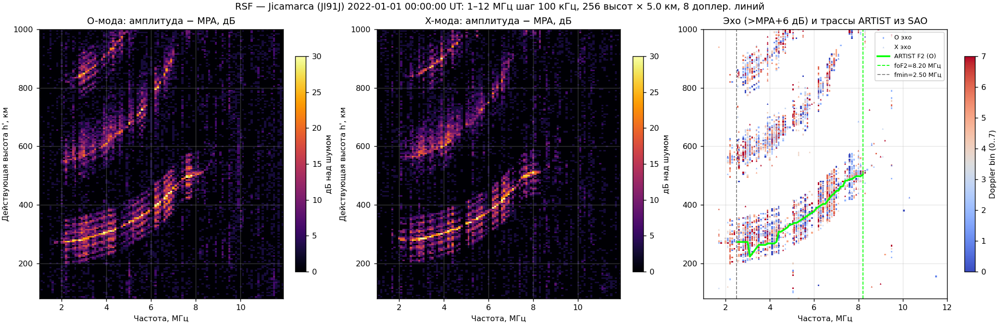
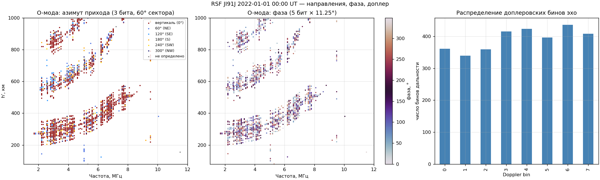
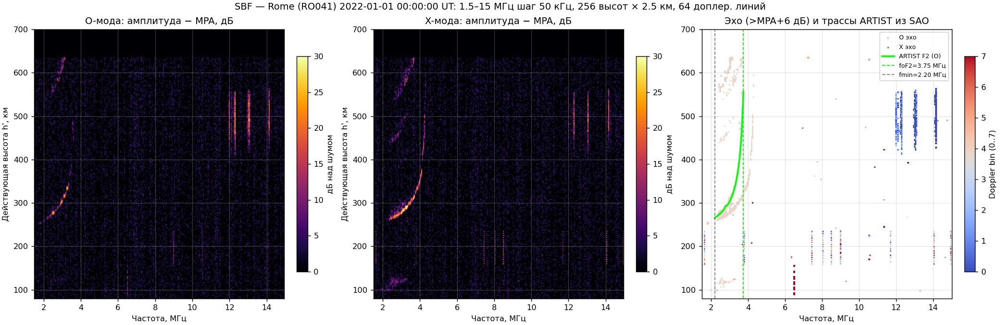
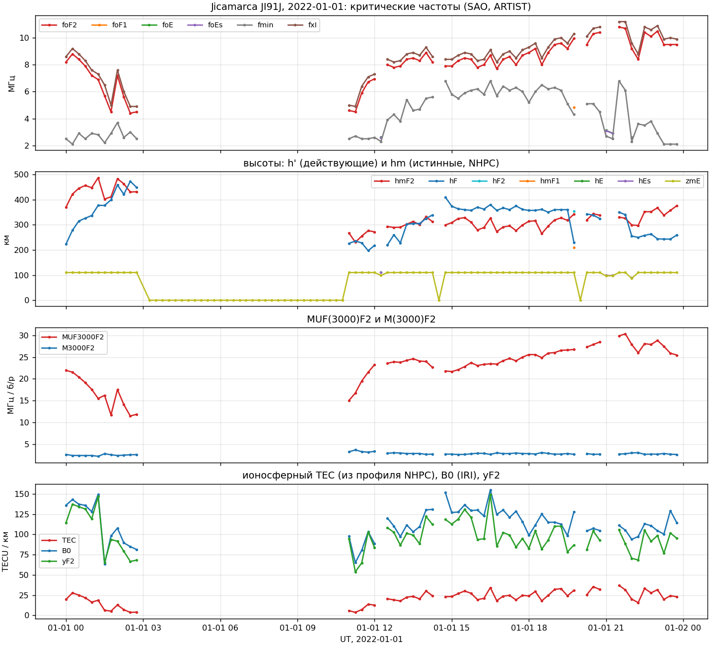
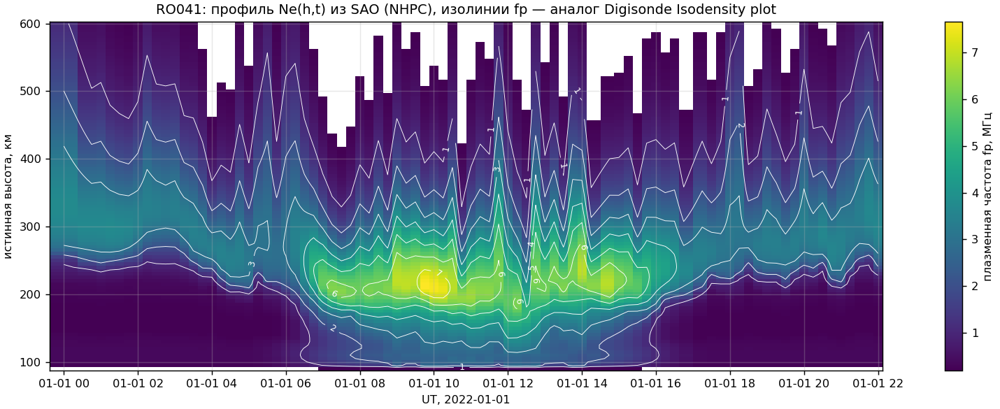
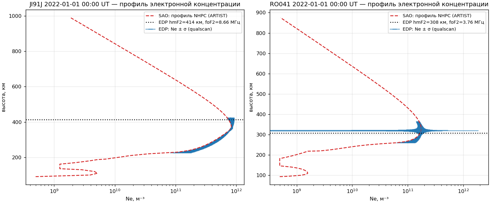

# Ионограммы: краткий курс, источники данных, форматы дигизонда (RSF, SBF, SAO, EDP, DFT) и обработка в `pynasonde`

Файл состоит из двух частей. **Часть I** — краткий курс: термины, источники данных и API,
проблематика интерпретации, наклонное зондирование, размеченные датасеты, идеи онлайн-сервиса.
**Часть II** — технический отчёт по осмотру образцов `RSF-samples-w-img-n-sao-n-dft/` и
`SBF-samples-w-img-n-sao/`: спецификации форматов, картинки ([`figures/`](../figures/)), парсеры
([`digi_formats.py`](../pyon/digi_formats.py)), проверка `pynasonde`.

Источники: монография Литвинов С.В., Скрипачев В.О. «Метод исследования ионосферы Земли
радиоэлектронными системами наземного базирования» (МИРЭА, 2026) — гл. 1.1.5–1.1.9, 1.2, 2.3.1;
Bilitza et al. (2022) обзор IRI; Digisonde-4D System Manual; РД 52.26.817-2023 (Росгидромет,
«Руководство по ионосферным наблюдениям»); диссертация Щирого А.О. (2007) по НЗ ЛЧМ-сигналом;
сайты GIRO/LGDC/NOAA (проверены 2026-08-28).

---

# Часть I. Краткий курс

## I.1. Базовые термины

**Ионосфера** — ионизованная часть верхней атмосферы (≈60–1000+ км), где есть свободные электроны в
количестве, достаточном, чтобы влиять на радиоволны. Главная характеристика — **электронная
концентрация Nₑ(h)** (м⁻³ или см⁻³). Слои (по максимумам Nₑ): **D** (60–90 км, только днём, поглощает),
**E** (100–120 км), **F1** (150–200 км, днём), **F2** (200–400 км, главный максимум, есть всегда), плюс
**спорадический Es** (тонкий, нерегулярный, ~100 км).

**Плазменная частота** f₀ = 8.98·√Nₑ [кГц при Nₑ в см⁻³] (формула 2.10 монографии; в IRI-обзоре
Nₑ = 1.24·10¹⁰·f² м⁻³ при f в МГц). Радиоволна частоты f отражается от уровня, где f₀(h) = f (для
O-моды). Отсюда всё: измеряя, на каких частотах и с какой задержкой приходят отражения, «прощупываем»
Nₑ(h) снизу вверх до максимума слоя.

**Ионозонд (ионосферная станция, ИС)** — импульсный (или ЛЧМ) ВЧ-радар для зондирования ионосферы.
Состав (монография, §1.1.5): **возбудитель (импульсный генератор, генератор импульсов / задающий
генератор)** формирует короткие радиоимпульсы 50–200 мкс на перестраиваемой частоте (обычно 1–20 МГц);
**передатчик** — широкополосный усилитель мощности (0.3–10 кВт), излучает через **передающую антенну**
(обычно ромб/дельта, вертикально вверх); **приёмник** с **приёмной антенной** (у дигизонда — 4 скрещённые
рамки-«кресты») перестраивается синхронно с передатчиком; **синхронизатор** (сейчас — GPS/ГЛОНАСС-время,
±1 мкс) задаёт моменты излучения; **калибраторы высот и частот**, **вычислительный комплекс**.
На старых аналоговых АИС результат рисовался электронно-лучевым индикатором с фоторегистратором.

**Развёртка** — в ионозонде их две: (1) **частотная развёртка (sweep)** — последовательный перебор
частот от нижней к верхней (у дигизонда шаг 25–100 кГц, полный цикл 1–15 МГц ≈ 1–4 мин; у ЛЧМ-зонда
частота меняется непрерывно линейно, скорость 50–500 кГц/с); (2) **развёртка по дальности** — на
каждой частоте приёмник «слушает» после импульса и раскладывает эхо по времени задержки τ →
действующая дальность/высота h′ = c·τ/2 (у дигизонда 2.5/5/10 км на бин, 128–512 бинов).
Исторически «система развёрток» — это блок, управлявший лучом ЭЛТ индикатора по частоте и высоте.

**Ионограмма = высотно-частотная характеристика (ВЧХ)** — панорамное изображение h′(f): по оси X частота,
по оси Y действующая высота, яркость — амплитуда эха. Геометрическое место максимумов эха на плоскости
называют **треком / следом** слоя. **Действующая (виртуальная) высота h′** всегда больше **истинной h**,
потому что групповая скорость в плазме меньше c; пересчёт h′(f) → Nₑ(h) — решение интегрального
уравнения (1.3 монографии), выполняется программами инверсии (**NHPC** у Lowell, **POLAN**).

**Критическая частота** слоя (foE, foF1, foF2) — частота, выше которой волна проходит слой насквозь; на
ионограмме след уходит вверх «в бесконечность» (асимптота). **fmin** — нижняя частота, на которой ещё
видно эхо (определяется поглощением в D-области). **fxI, fxF2** — то же для X-моды.

**O- и X-мода (обыкновенная и необыкновенная)** — из-за геомагнитного поля волна расщепляется на две с
разной поляризацией; X-след сдвинут по частоте примерно на половину гирочастоты (≈0.5–0.7 МГц) и
отражается чуть ниже. Дигизонд разделяет их по круговой поляризации приёмных антенн; на картинках
Lowell O — красный, X — зелёный.

**Кратники (многоскачковые отражения 2F, 3F)** — след повторяется на высотах 2h′, 3h′: импульс
отразился от ионосферы, вернулся к земле, отразился от земли и снова ушёл вверх — и так 2–3 раза, а
приёмник слышит каждое возвращение. «Кратность» = число таких проходов; след 1-й кратности (1F2) —
единственное «настоящее» отражение, 2F2 и 3F2 — его копии, растянутые по высоте в 2 и 3 раза и
сжатые по частоте (для двухскачкового пути угол падения круче, и предельная частота ниже). **Снимать
параметры по 1-й кратности** значит: foF2, h′F, hmF2 и профиль берутся только с основного следа, а
кратники надо *распознать и отбросить* — иначе h′F получится 2×, а «второй слой» на 600 км — фантом.
Кратники сильны ночью и при слабом поглощении (см. Jicamarca 00 UT: 1F, 2F, 3F одновременно).

**Spread-F (F-рассеяние)** — след F размыт по высоте (range spread) и/или по частоте (frequency spread)
из-за неоднородностей; типичен для ночного экватора и высоких широт; главная причина отказов автоскейлинга.

**МПЧ / MUF(D)** — максимально применимая частота для радиотрассы длиной D; по ВЗ оценивается через
**M(3000)F2** = MUF(3000)/foF2 (закон секанса, §1.1.9). **B0, B1** — параметры толщины/формы нижней
части F2 в модели IRI. **TEC** — интегральная электронная концентрация.

**Дигизонд (Digisonde, DPS-4 / DPS-4D)** — цифровой ионозонд UMass Lowell / Lowell Digisonde
International: 300 Вт вместо 10 кВт за счёт внутриимпульсного фазового кодирования, цифрового сжатия и
доплеровского интегрирования; 4 приёмные антенны → интерферометрия (направление прихода), доплер,
поляризация O/X; программы **ARTIST** (автоскейлинг), **NHPC** (профиль), **Drift-X** (скорость дрейфа
плазмы по DFT/SKY/DVL). Самый массовый прибор в мире (~80 станций сети GIRO; в России 6: IR352 Иркутск,
N0369 Норильск, YA462 Якутск, ZH466 Жиганск, MO155 Москва/Троицк, LD160 Горьковская — табл. 1.1
монографии). Российские аналоги: **«Парус-А»** (ИПГ/ИЗМИРАН, 10 станций Росгидромета: MA155, TZ362,
RV149, MO156, MA560, SH266, NV355, KL154, PK553, KB547), «Авгур», «Вектор», «Радуга», «ТОМИОН», БСД, CADI
(Канада, дешёвый сетевой).

**Виды зондирования** (§1.1.5–1.1.8): **ВЗ** — вертикальное (Tx и Rx в одной точке, излучение вверх);
**НЗ** — наклонное (Tx и Rx разнесены на сотни–тысячи км, синхронизированы по GPS; результат — зависимость
группового запаздывания от частоты для трассы, **дистанционно-частотная характеристика (ДЧХ)**);
**ВНЗ** — возвратно-наклонное (Tx и Rx вместе, принимается рассеяние от земли за «мёртвой зоной»);
**совмещённое ВЗ+НЗ** (оба зонда с включёнными передатчиками, на одной ионограмме следы ВЗ до ~5 МГц и НЗ на
6–11 МГц — рис. 1.18); **ТИЗ/ОТИЗ** — трансионосферное (со спутника / на спутник).
**ЛЧМ-ионозонд (chirp sounder)** — вместо импульсов непрерывный сигнал с линейно растущей частотой;
приёмник свёртывает его с копией и получает задержки; мощность десятки ватт; основной инструмент НЗ
(российская сеть ИСЗФ СО РАН / ИЗМИРАН / МарГУ — трассы Магадан–Иркутск, Норильск–Иркутск и др.).

**Автоскейлинг (autoscaling, автоматическая обработка ионограммы)** — выделение следов и снятие
характеристик программой; **ручная обработка (скейлинг оператором)** — по РД 52.26.817 оператор
обрабатывает «часовые» ионограммы (XX:00 UT); результат кодируется по правилам URSI (буквы качества Q и
описательные D — «Руководство URSI», в `lit/`). **URSI-код станции** — 5 символов (JI91J, RO041, MO155).

## I.1-bis. Физика и техника «на пальцах»: почему это вообще работает

### (а) Почему свободные электроны в газе влияют на радиоволну

Нейтральный газ радиоволне почти безразличен (молекулы — жёсткие диполи, откликаются слабо). Свободный
электрон — другое дело: он лёгкий и заряженный, и электрическое поле волны **E = E₀·cos(ωt)** его
раскачивает. Второй закон Ньютона: *m·ẍ = −e·E* → электрон колеблется с амплитудой *x = eE/(mω²)*,
**в противофазе** с полем (знак минус: чем ниже частота, тем сильнее раскачка). Миллионы таких
колеблющихся электронов в кубометре — это переменный ток, а ток создаёт своё поле, которое вычитается из
поля волны. В терминах электродинамики это диэлектрическая проницаемость среды

  ε = 1 − Nₑe²/(ε₀ m ω²) = 1 − (f₀/f)²,   где f₀ = (1/2π)·√(Nₑe²/(ε₀m)) ≈ 8.98·√Nₑ [Гц, Nₑ в м⁻³] — **плазменная частота**

(это и есть формула 2.10 монографии: «плазменная частота — макроскопическая характеристика множества
электронов»). Ионы делают то же самое, но они в 30 000+ раз тяжелее — их вклад ничтожен, поэтому говорят
именно об *электронной* концентрации.

> **Про единицы Nₑ.** Nₑ — счётная концентрация (электронов на единицу объёма). В радиофизике и в
> форматах ионозондов (SAO `ED`, URSI, «Парус-А», монография) традиционно **см⁻³**, в IRI, EDP и
> спутниковых данных — **м⁻³** (1 см⁻³ = 10⁶ м⁻³). Формула одна: f_p[Гц] = 8.98·√Nₑ[м⁻³] ⇔
> f_p[кГц] = 8.98·√Nₑ[см⁻³] ⇔ Nₑ[м⁻³] = 1.24·10¹⁰·f_p²[МГц]. Проверка: foF2 = 8.2 МГц → 8.3·10¹¹ м⁻³ =
> 8.3·10⁵ см⁻³ — ровно максимум профиля в SAO (`.832E+6`) и в EDP (`0.93E+12` с учётом другого hmF2).
> Типичные значения: E ~10⁵ см⁻³, максимум F2 10⁵–10⁶ см⁻³ (ночью 10⁴–10⁵), при нейтралах ~10⁹ см⁻³ на
> 300 км — ионизовано ~0.1 %. TEC — не объёмная, а столбовая величина ∫Nₑ dh, 1 TECU = 10¹⁶ эл/м².

#### Плазменная частота и ε: откуда берутся формулы и коэффициенты

**Что такое ε.** Уравнения Максвелла в среде связывают поле **E** и «электрическую индукцию»
**D = ε₀E + P**, где **P** — поляризация: суммарный дипольный момент единицы объёма, который среда
приобретает под действием поля. Если **P** пропорционально **E** (линейная среда), пишут
**D = ε₀·ε·E**; безразмерное ε — *относительная диэлектрическая проницаемость* (в вакууме ε = 1, ε₀ =
8.854·10⁻¹² Ф/м — константа, переводящая единицы). Для волны важно, что скорость света в среде
c/√ε, т.е. **показатель преломления n = √ε** (при магнитной проницаемости μ = 1). Всё, что делает
среда с радиоволной — замедляет, преломляет, отражает, — сидит в ε(ω).

**Вывод для газа свободных электронов (без столкновений и магнитного поля).** Электрон массы m и
заряда −e в поле волны E = E₀·e^{iωt}:

  m·ẍ = −e·E  →  x = e·E/(m·ω²)   (гармоническое решение, смещение в противофазе с полем).

Дипольный момент одного электрона −e·x, электронов Nₑ в м³, значит поляризация

  P = −Nₑ·e·x = −(Nₑe²/(m·ω²))·E,   D = ε₀E + P = ε₀·[1 − Nₑe²/(ε₀·m·ω²)]·E,

откуда

  **ε = 1 − ω_p²/ω²,   ω_p² = Nₑe²/(ε₀·m)**   (ω_p — плазменная частота, в радианах/с).

Это и есть формула (2.12) монографии. Почему «плазменная частота» — частота собственных колебаний
электронного газа: если сместить слой электронов на x относительно ионов, возникает возвращающее поле
E = Nₑ·e·x/ε₀ (как в конденсаторе), и уравнение m·ẍ = −e·E даёт осциллятор с ω² = Nₑe²/(ε₀m). Волна
с ω > ω_p раскачивает электроны «слабее, чем они сами хотят колебаться» — среда почти прозрачна;
при ω < ω_p электроны успевают полностью экранировать поле — ε < 0, волна не проходит. Аналогия с
металлом: там электронов ~10²² см⁻³ и ω_p лежит в ультрафиолете (Na ≈ 210 нм, K ≈ 330 нм, Al ≈ 80 нм),
поэтому видимый свет (ω < ω_p) металлы отражают — «блестят». Обратное предсказание модели —
прозрачность выше ω_p — буквально выполняется только для щелочных металлов (опыт Вуда, 1933: плёнки
Na, K прозрачны в УФ короче плазменной длины волны); у Cu, Ag, Au, Al картину размазывают межзонные
переходы связанных электронов, которые поглощают в видимой/УФ-области. Ионосфера — чистый случай
модели: электроны действительно свободные, поглощение слабое, ω_p — в мегагерцах.

**Числа.** e = 1.602·10⁻¹⁹ Кл, m = 9.109·10⁻³¹ кг, ε₀ = 8.854·10⁻¹² Ф/м:

  f_p = ω_p/2π = (1/2π)·√(Nₑe²/(ε₀m)) = √(e²/(4π²ε₀m))·√Nₑ,
  e²/(4π²ε₀m) = (1.602·10⁻¹⁹)² / (39.48 · 8.854·10⁻¹² · 9.109·10⁻³¹) = 2.566·10⁻³⁸ / 3.184·10⁻⁴⁰ ≈ **80.6** м³/с².

Отсюда все встречающиеся в литературе коэффициенты — это одно число 80.6 в разных одеждах:

| Форма | Коэффициент | Откуда |
|---|---|---|
| f_p[Гц] = **8.98**·√Nₑ[м⁻³] | √80.6 = 8.98 | корень из 80.6 |
| f_p[кГц] = 8.98·√Nₑ[см⁻³] | тот же | 1 см⁻³ = 10⁶ м⁻³ → √10⁶ = 10³ |
| Nₑ[м⁻³] = **1.24·10¹⁰**·f²[МГц] | 10¹²/80.6 = 1.24·10¹⁰ | обращение, f в МГц (формула (7) обзора IRI) |
| Nₑ[см⁻³] = 1.24·10⁴·f²[МГц] | 10⁶/80.6 | то же в см⁻³ |
| n² = 1 − **80.6**·Nₑ[м⁻³]/f²[Гц] | 80.6 | ε напрямую; в теории распространения обозначается X = f_p²/f² |

Проверка: foF2 = 8.2 МГц → Nₑ = 1.24·10¹⁰·8.2² = 8.3·10¹¹ м⁻³ (SAO Jicamarca: `.832E+6` см⁻³ ✓).

**Что добавляют столкновения и магнитное поле** (формула Эпплтона–Хартри — общий случай, из неё
ARTIST/NHPC считают профили):

  n² = 1 − X / [ 1 − iZ − Y_T²/(2(1−X−iZ)) ± √( Y_T⁴/(4(1−X−iZ)²) + Y_L² ) ],
  X = f_p²/f²,  Y = f_H/f,  Z = ν/(2πf),

где f_H = eB/(2πm) = 2.80·10¹⁰·B[Тл] Гц — **гирочастота** (B ≈ 50 мкТл → f_H ≈ 1.4 МГц; Y_L, Y_T —
проекции вдоль/поперёк волны), ν — частота столкновений электронов с нейтралами. Знак «±» даёт две
волны — **O и X**; при Z = 0 O-мода отражается при X = 1 (f = f_p), X-мода при X = 1 − Y
(f ≈ f_p + f_H/2 для f ≫ f_H); Z ≠ 0 делает n комплексным — мнимая часть и есть **поглощение**,
∝ Nₑ·ν/f² в приближении слабых столкновений. Без B и ν формула сворачивается в ε = 1 − X выше.
Все три безразмерные величины X, Y, Z — стандартные обозначения в теории распространения (Ratcliffe,
Budden; в русской литературе — Гинзбург, «Распространение электромагнитных волн в плазме»).

Следствия, из которых складывается вся ионограмма:

* **показатель преломления n = √ε < 1** и *падает* с ростом Nₑ. Пока f ≫ f₀, n ≈ 1 — волна проходит
  (так работают спутниковая связь и GPS, лишь с задержкой ∝ TEC/f²). При f → f₀ n → 0.
* **при f < f₀ ε < 0**, n мнимый — волна в такой среде распространяться не может, поле экспоненциально
  затухает вглубь (эванесцентная волна), энергия возвращается назад. Это и есть «отражение», хотя никакой
  поверхности нет.
* фазовая скорость c/n > c, а **групповая скорость v_гр = c·n < c** (энергия/импульс движутся медленнее).
  Именно поэтому измеренная по задержке высота h′ = ∫dh/n больше истинной — волна «застревает» вблизи
  уровня отражения, где n → 0 (формула 1.3 монографии — это интеграл от 1/n).
  *Как волна вообще может замедлиться, если свет всегда идёт с c?* В среде поле = исходная волна +
  поля, переизлучённые колеблющимися электронами; каждое из них бежит с c, но их сумма — волна с
  другим набегом фазы, т.е. со скоростью c/n. В плазме электроны колеблются в противофазе → n < 1 и
  **фазовая** скорость (движение гребней бесконечной синусоиды) больше c — это допустимо, гребни не
  несут информации. Реальный импульс — пакет частот; его огибающая идёт с **групповой** скоростью
  dω/dk = c·n < c (v_фаз·v_гр = c²): часть энергии волны в каждый момент «припаркована» в
  кинетической энергии электронов и не движется, и чем плотнее плазма, тем большая доля. У точки
  отражения n → 0: длина волны → ∞ (все электроны колеблются в фазе, «гребней» нет), v_гр → 0 —
  импульс останавливается и разворачивается, как мяч на вершине траектории. Аналогия: цепочка людей
  передаёт мяч — в полёте он всегда движется с c, но каждый задерживает его в руках; средняя скорость
  вдоль цепочки меньше c, и «задержка в руках» становится бесконечной там, где f_p = f.
* **столкновения** электронов с нейтралами (частота ν) добавляют к ε мнимую часть → **поглощение**
  ∝ Nₑ·ν/f². В D-области (60–90 км) ν огромна, поэтому днём низкие частоты «съедаются» — отсюда fmin и
  исчезновение следа E/F1 в полдень.
* **геомагнитное поле** заставляет электрон вращаться (гирочастота f_H = eB/2πm ≈ 1–1.5 МГц). Среда
  становится двулучепреломляющей (формула Эпплтона–Хартри, n² = 1 − X/(1 ∓ Y), X = f₀²/f², Y = f_H/f):
  O-мода отражается при f = f₀, X-мода — при f ≈ f₀ + f_H/2. Отсюда два следа и сдвиг ≈ 0.5–0.7 МГц
  (у Rome fxI − foF2 = 4.30 − 3.75 = 0.55 МГц).

#### O- и X-моды «на пальцах»: одна волна, две половинки, разная высота разворота

Главное сразу: **частота у O и X одна и та же** — та, что излучил передатчик. Расщепляется не
частота, а *поляризация*, и из-за магнитного поля Земли две половинки одной волны разворачиваются на
разной высоте.

1. **Поляризация.** Радиоволна — колеблющийся вектор электрического поля **E**. У провода-антенны E
   качается вдоль одной линии — *линейная* поляризация. Две перпендикулярные антенны, запитанные со
   сдвигом в четверть периода, дают вектор E, который не качается, а **вращается по кругу** — *круговая*
   поляризация (правая или левая), как две качели под 90° со сдвигом фазы дают движение по окружности.
   Обратно: любая линейная волна = сумма правой и левой круговых. («Плоская волна» — лишь идеализация:
   вдали от антенны фронт волны плоский и поле во всей плоскости одинаково.)
2. **Без магнитного поля** электрон качается вдоль E, отклик среды одинаков для любой поляризации →
   одна волна, одно условие разворота f = f_p.
3. **С магнитным полем Земли** свободный электрон не может двигаться прямо: сила Лоренца −e·v×B
   заворачивает его по окружности вокруг силовой линии с *гирочастотой* f_H = eB/2πm ≈ 1.2–1.5 МГц
   (свойство электрона в поле, от волны не зависит). Круговая компонента волны, вращающаяся **в ту же
   сторону**, что электрон, раскачивает его «в такт» — отклик сильный, среда для неё «плотнее»
   (n меньше); компонента, вращающаяся **против**, — отклик слабый. Одна среда — **два показателя
   преломления** для двух вращений: двулучепреломление, знак «±» в формуле Эпплтона–Хартри.
   Компоненту, ведущую себя почти как без поля, назвали **обыкновенной (O)**, вторую —
   **необыкновенной (X)**. X ниоткуда не «берётся» — это вторая половинка исходной волны.
4. **Что происходит с импульсом дигизонда.** Импульс на, скажем, 4.0 МГц, войдя в ионосферу,
   распадается на O и X — обе на 4.0 МГц. O разворачивается там, где f_p = 4.0 МГц; X — **ниже**, где
   f_p ≈ 4.0 − f_H/2 ≈ 3.3 МГц (для неё n = 0 наступает раньше). Обе возвращаются; у X задержка чуть
   меньше. Различить их можно только по направлению вращения поля — дигизонд делает это двумя
   скрещёнными рамками (сумма со сдвигом +90°/−90° = приёмник правого/левого вращения), чередуя
   режимы от импульса к импульсу; отсюда группы «O» и «X» в RSF/SBF (код 3/2 в PRELUDE).
5. **След на ионограмме.** Перебираем частоты для слоя с foF2 = 3.75 МГц (Rome, 00 UT): O отражается
   при f ≤ 3.75, на 3.75 след уходит в асимптоту — это **foF2**; X на частоте f отражается от уровня
   f_p ≈ f − f_H/2, поэтому отражается ещё при f ≈ 4.3–4.5 и уходит насквозь позже — её асимптота
   **fxF2 ≈ foF2 + f_H/2** (у Rome fxI = 4.30, разница 0.55 МГц). Итог: **два одинаковых по форме следа,
   X сдвинут вправо на ≈ 0.5–0.7 МГц и лежит чуть ниже O на той же частоте**; так же раздвоены следы
   E и F1. На картинках Lowell O — красный, X — зелёный; на нашей SBF-ионограмме Rome — панели O и X.
   (Есть ещё третья, Z-мода — второй корень при f ≈ f_p − f_H/2, видна обычно в высоких широтах.)
6. **Зачем это нужно.** Характеристики снимают по O (foF2 — это O); X — контроль: fx − fo должно
   быть ≈ f_H/2 (наше ограничение V4); по расщеплению вычисляют f_H и сверяют с моделью поля; при
   срезанном O-следе foF2 восстанавливают как fxF2 − f_H/2 (так делает ARTIST); без поляризационных
   антенн X-след легко принять за отдельный слой — типичная ошибка интерпретации; в онтологии тезисов
   магнитоионная компонента — четвёртый признак моды (`hasMagnetoionicComponent`, «2F2пX»), причём в
   наклонных ЛЧМ-ионограммах O/X обычно не разрешаются (Щирый 2007, с. 118), а в дигизондных — всегда.

### (б) Как волна «отражается», если нет поверхности

**Где именно.** Волна частоты f идёт вверх, пока f_p(h) < f (внизу ионосферы f_p мала), и
разворачивается на уровне **f_p(h) = f**; выше него f_p > f, ε < 0 — там волна существовать не может.
Если такого уровня нет (максимум f_p = foF2 меньше f), волна уходит в космос. Отражение происходит
на уровне *равенства*, а не «пока плазменная частота меньше»: пока меньше — волна проходит, только всё
медленнее.

**Почему не идёт дальше — микроскопическая картина.** Электроны колеблются в противофазе с полем
волны и излучают встречное поле; чем ближе f_p к f, тем оно сильнее. При f_p = f электроны колеблются
на своей собственной частоте и их излучение **полностью гасит** поле волны вперёд — выше поле только
экспоненциально спадает (как свет, «входящий» в металл на доли длины волны). Поглощения почти нет,
энергии некуда деться, кроме как назад: встречное поле электронов, погасившее волну вперёд, и есть
волна назад.

**Почему поверхность не нужна — «тысяча тонких зеркал».** Разобьём ионосферу на слои по 100 м. На
каждой границе n чуть отличается и даёт крошечное отражение (любой скачок n отражает, как стекло).
Внизу, где локальная длина волны ~75 м, а n меняется на проценты на километр, отражения соседних слоёв
приходят с разными фазами и **гасят друг друга** — суммарно ноль, волна идёт как в вакууме.
У уровня f_p = f локальная длина волны λ/n растёт (n → 0): 300 м, 1 км, 10 км… Когда она становится
больше толщины, на которой n заметно меняется, отражения всех слоёв складываются **в фазе** —
отражение становится полным. «Поверхность» — это уровень, где плавная среда перестаёт быть плавной
*по сравнению с длиной волны*. (Коэффициент отражения от градиента масштаба L ≫ λ ~ e^{−L/λ},
ничтожен; в точке поворота λ_лок → ∞ и условие L ≫ λ ломается.)

**Та же ли это волна.** Та же: уравнения Максвелла в такой среде имеют одно решение — стоячую волну
(функция Эйри), которая ниже точки поворота выглядит как «бегущая вверх + бегущая вниз», а выше —
гаснущий хвост. «Падающая» и «отражённая» — наше разложение одного поля на удобные части. Частота и
поляризация те же, фаза сдвинута на −π/2; именно поэтому дигизонд измеряет доплер по фазе эха —
это тот самый сигнал, что он излучил.

Интуиция «зеркало и острый угол» здесь не подходит. Ионосфера — среда, у которой n плавно убывает с
высотой (масштаб изменений — километры и десятки км), а длина волны — 15–300 м. Волна не встречает
границу, а **непрерывно преломляется**, как свет в атмосфере при мираже или мяч, брошенный вверх в
поле тяжести:

* **вертикальное падение**: волна идёт вверх, n падает, групповая скорость падает, на уровне n = 0
  («точка поворота») она останавливается и возвращается по той же вертикали — «отражение» происходит
  в слое толщиной порядка длины волны вокруг точки поворота. Строгое решение уравнений Максвелла с
  линейно меняющимся ε даётся функцией Эйри: падающая и отражённая волны — **одна и та же стоячая
  волна**, а не два разных луча; у точки поворота волна «переворачивает» фазу на −π/2. Поскольку
  градиент плавный (масштаб ≫ λ), отражение **когерентное, почти без потерь** — это не рассеяние на
  шероховатостях, а аналог полного внутреннего отражения.
* **наклонное падение** (НЗ): по закону Снеллиуса n(h)·sinθ(h) = sinθ₀; по мере подъёма n падает, θ
  растёт до 90° — луч плавно **изгибается дугой** и поворачивает вниз там, где n = sinθ₀, т.е. при
  f₀(h) = f·cosθ₀. Отсюда **закон секанса** f_нз = f_вз/cosθ₀ (формула 1.6 монографии): наклонно можно
  «пробить» слой на частоте выше критической — вот почему МПЧ трассы в 2–3 раза больше foF2.
* **почему «зеркало» всё-таки работает для расчётов** — теорема Брейта–Тьюва (§1.1.9): время хода по
  реальной изогнутой траектории с групповой скоростью **равно** времени хода со скоростью c по
  треугольнику с вершиной на *действующей* высоте h′. Поэтому ионограмма рисуется так, будто есть
  зеркало на высоте h′ — это точная эквивалентность по времени, а не физика.
* когда среда **действительно** неровная (неоднородности от сотен метров до десятков км — spread-F,
  Es-облака, ПИВ), отражение становится частично **диффузным**: эхо приходит с разных направлений и с
  разными задержками — след размывается. Дигизонд именно это и измеряет азимутом/зенитным углом (RSF)
  и доплером: «вертикальное отражение» — код азимута 0, «боковые» — секторы. Так что диффузность —
  не норма, а признак возмущения, и это одна из вещей, которую надо распознавать.
* тонкий слой (Es толщиной ~1 км, сравнимой с λ) волна может **частично** проходить насквозь
  (туннелирование через эванесцентную область) — отсюда полупрозрачность Es и след F выше него.

### (в) Генератор: что физически происходит и как это попадает на антенну

Цепочка передатчика: **задающий генератор → формирователь импульса (модулятор) → предусилитель →
широкополосный усилитель мощности → согласующее устройство → фидер (коаксиальный кабель) → антенна**.

1. **Генератор (возбудитель)** — источник синусоидального напряжения на нужной частоте.
   *Классический автогенератор*: усилитель + положительная обратная связь через резонансный контур
   (катушка L и конденсатор C — «колебательный контур», или кварцевый резонатор). Тепловой шум на
   резонансной частоте усиливается, возвращается на вход в фазе, снова усиливается — колебание
   нарастает, пока нелинейность усилителя не ограничит амплитуду (условие Баркгаузена: петлевое
   усиление = 1, набег фазы = 0). Частота задаётся f = 1/(2π√LC): в старых АИС мотор **вращал ротор
   переменного конденсатора** задающего генератора — это и была частотная развёртка (§1.1.1 монографии).
   *Современный вариант (DPS-4D, «Парус-А», ЛЧМ-зонды)*: **DDS — прямой цифровой синтез**: цифровой
   аккумулятор фазы прибавляет на каждом такте опорного кварцевого генератора число Δφ, старшие биты
   адресуют таблицу синуса, ЦАП превращает отсчёты в напряжение, фильтр сглаживает. Частота = Δφ·f_такт/2ᴺ,
   меняется мгновенно записью нового числа (поэтому дигизонд перескакивает по 25–100 кГц за микросекунды,
   а ЛЧМ-зонд ведёт частоту линейно и непрерывно). Опорный кварц дисциплинируется от GPS — отсюда
   точность частоты и общее время у Tx и Rx на разных концах трассы НЗ.
2. **Формирование импульса.** Непрерывную синусоиду «включают» на 50–200 мкс ключом (модулятором) —
   получается радиоимпульс. У дигизонда внутри импульса 533 мкс ещё и **фазовое кодирование**: 16
   «чипов» по 33.3 мкс, в каждом фаза 0° или 180° по коду Голея (комплементарные пары). Приёмник
   сворачивает эхо с копией кода — это **сжатие импульса**: разрешение по дальности как у короткого
   импульса 33 мкс (5 км), а энергия — как у длинного. Именно поэтому дигизонду хватает 300 Вт там, где
   старым станциям нужны были 10 кВт (§1.2.1).
3. **Усиление.** Импульс с уровня милливатт поднимают до сотен ватт — киловатт. Транзисторный (MOSFET,
   двухтактный) каскад, питание +50 В, нагрузка через ферритовые трансформаторы на линиях (см. «полоса» ниже).
4. **Согласование и фидер.** Выход усилителя (50 Ом) через коаксиальный кабель подаётся на антенну.
   Если сопротивление антенны на данной частоте ≠ 50 Ом, часть мощности отражается обратно (КСВ) — греет
   усилитель и не излучается; поэтому либо антенну делают широкополосной, либо ставят перестраиваемое
   согласующее устройство (антенный тюнер).
5. **Антенна.** В проводе течёт переменный ток с частотой f; ускоренно движущиеся заряды излучают
   электромагнитную волну — антенна превращает «волну в кабеле» в волну в пространстве. Для ионозонда
   нужна антенна, излучающая **вверх** и работающая на всех 1–30 МГц: у дигизонда — скрещённые дельты
   (два треугольника проводов на 30-м мачте с поглощающими резисторами на концах — за счёт резисторов
   антенна апериодическая, т.е. широкополосная, ценой КПД), у российских станций — ромбы/дельты/«зигзаг».
   Приёмные антенны дигизонда — 4 малых скрещённых рамки: они принимают магнитное поле волны, а разность
   фаз между рамками (расстояние 60 м) даёт направление прихода (интерферометрия); сложение двух
   ортогональных рамок со сдвигом ±90° выделяет правую/левую круговую поляризацию, т.е. O- или X-моду.

### (г) «Широкополосный усилитель» и что такое «полоса»

Слово «полоса» здесь встречается в **двух разных смыслах**, и их важно не путать:

* **Рабочий диапазон (полоса) усилителя/антенны** — интервал частот, в котором устройство сохраняет
  усиление и согласование (обычно критерий −3 дБ). *Узкополосный (резонансный)* усилитель имеет на выходе
  LC-контур, настроенный на одну частоту: высокий КПД, хорошая фильтрация, но на каждом шаге развёртки
  его нужно **перестраивать** (в старых АИС — тем же мотором). *Широкополосный* усилитель работает без
  перестройки во всём диапазоне 1–30 МГц: вместо резонансных контуров — трансформаторы на длинных
  линиях с ферритами, отрицательная обратная связь, двухтактная схема; за это платят КПД (30–50 %)
  и уровнем гармоник (нужен переключаемый фильтр нижних частот на выходе). Ионозонд прыгает по
  частотам сотни раз за минуту, поэтому передатчик и антенна обязаны быть широкополосными — это
  ключевое конструктивное отличие ионозонда от связного передатчика на фиксированной частоте.
* **Мгновенная полоса сигнала** — ширина спектра самого зондирующего импульса: импульс длительностью τ
  занимает полосу ≈ 1/τ (100 мкс → 10 кГц; чип 33 мкс у дигизонда → ~30 кГц; ЛЧМ-сигнал со скоростью
  100 кГц/с при окне анализа 1 с → 100 кГц). **Полоса приёмника** должна совпадать с полосой сигнала:
  уже — размывается импульс и падает разрешение по дальности (Δh = c·τ/2), шире — лишний шум и помехи.
  Отсюда же **шаг частот** ионограммы и то, почему помехи от вещательных станций (полоса 10 кГц) выглядят
  на ионограмме как узкие вертикальные столбцы: они попадают в полосу приёмника только на 1–2 шагах
  развёртки.
* **Динамический диапазон / амплитуда в дБ.** Амплитуды в RSF/SBF — логарифмические (шаг 3 дБ), потому
  что эхо от F2 и шум различаются на 60–90 дБ (в миллион раз по мощности); MPA — оценка уровня шума в
  той же полосе на той же частоте, поэтому «эхо» разумно определять как amp > MPA + порог.

### (д) Развёртка по высоте (дальности): приёмник ничего не «сканирует»

Развёртка по частоте — действительно просто перебор частот. Развёртка по высоте устроена иначе:
приёмник **не перестраивается по задержкам**, он после каждого импульса просто непрерывно слушает и
**оцифровывает всё подряд**, а время прихода каждого отсчёта само и есть его высота.

1. В момент t = 0 передатчик излучает импульс. Эхо от уровня h возвращается через t = 2h/c:
   100 км → 0.67 мс, 300 км → 2 мс, 1000 км → 6.7 мс.
2. Сразу после импульса открывается приёмник (во время излучения он заперт, иначе сгорит — отсюда
   «мёртвая зона» первых десятков км) и АЦП берёт отсчёты с фиксированным шагом Δt. У дигизонда
   Δt = 33.3 мкс → **один отсчёт = один бин дальности 5 км** (c·Δt/2); при 16.7 мкс — 2.5 км.
   Таких отсчётов делается M = 128/256/512 — это «number of heights» в PREFACE. Окно приёма
   256 × 33.3 мкс ≈ 8.5 мс покрывает 0–1280 км.
3. Отсчёт с номером k — это амплитуда и фаза сигнала, пришедшего с задержкой k·Δt, т.е. с действующей
   высоты h′ = h₀ + k·Δh (у нас h₀ = 80 км, Δh = 5 или 2.5 км). Массив из M отсчётов — «профиль по
   дальности» на данной частоте, одна частотная группа в RSF/SBF.
4. Затем излучается следующий импульс. Частота повторения PRR ограничивает **максимальную однозначную
   дальность**: при 200 имп/с интервал 5 мс → 750 км (Rome: 200 pps, окно до 717.5 км), при 100 имп/с →
   1500 км (Jicamarca: 100 pps, окно до 1320 км, чтобы ловить 2-е и 3-е кратники). Эхо, пришедшее позже
   следующего импульса, «завернётся» и покажется на ложной малой высоте.
5. На одной частоте делается не один, а N = 8…64 импульсов (CIT — время когерентного накопления,
   ~0.1–0.6 с). Получается матрица «номер импульса × бин дальности» (в радарной терминологии — *slow
   time × fast time*). По каждому бину дальности берётся FFT вдоль номеров импульсов → **доплеровский
   спектр** (частота изменения фазы эха от импульса к импульсу = скорость отражающего уровня; 8 линий с
   шагом ±0.39 Гц у Jicamarca — таблица в SAO), а суммирование по импульсам поднимает отношение
   сигнал/шум. Только после этого выбирается сильнейшая линия — и в бин RSF/SBF записывается
   «амплитуда + номер доплеровской линии». Плюс чередование импульсов между O/X и антеннами.

Откуда тогда слово «развёртка»? Из аналоговой эпохи: в АИС луч осциллографа после каждого импульса
**физически вёлся** снизу вверх по экрану синхронно со временем задержки (это и была «система
развёрток» из §1.1.1 монографии), эхо засвечивало точку на высоте, пропорциональной задержке, а
фотоплёнка медленно протягивалась вдоль оси частот. Цифровой ионозонд делает то же самое тактовым
генератором АЦП, но термин остался. Итого ионограмма — это трёхмерный куб *частота × дальность ×
импульс*, свёрнутый по третьей оси в амплитуду и доплер.

## I.2. Что это за ссылки, можно ли забирать данные, есть ли API

Всё это — один центр: **LGDC (Lowell GIRO Data Center)**, UMass Lowell, домены `giro.uml.edu`,
`lgdc.uml.edu`, `ulcar.uml.edu`.

| Ссылка | Что это | Доступ / API (проверено 2026-08-28) |
|---|---|---|
| https://giro.uml.edu/index.html | Портал **GIRO** (Global Ionospheric Radio Observatory): сеть ~100 дигизондов; продукты — DIDBase (17 млн ионограмм с характеристиками и профилями), DriftBase (10 млн skymap), **IRTAM**, GAMBIT, HR2006 (трассировка лучей), TID-диагностика | HTML-портал, ссылки на остальное |
| https://giro.uml.edu/didbase/scaled.php | **DIDBase FastChar** — веб-форма выгрузки автоскейленных характеристик (foF2, foF1, foE, foEs, h′F, hmF2, MUF(D), TEC, B0/B1 … ~40 штук) по станции и интервалу времени | **Есть рабочий текстовый API без регистрации** (форма редиректит на него): `https://lgdc.uml.edu/fastchar/getbest?ursiCode=JI91J&charName=foF2,hmF2,foE,foEs,MUFD&DMUF=3000&fromDate=2022/01/01+00:00:00&toDate=2022/01/01+03:00:00` → plain-text таблица `Time, CS, foF2 QD, hmF2 QD …` (CS — confidence score автоскейлинга 0–100, 999 = ручная обработка; QD — URSI-буквы качества/описания; проверено: foF2 = 8.2, hmF2 = 369.9 в 00:00 UT — совпадает с нашим SAO). Старый адрес `lgdc.uml.edu/common/DIDBGetValues?…` (цитируется в старых скриптах) **отдаёт 404** — заменён на `fastchar/getbest`. Работают публичные GET: `lgdc.uml.edu/common/DIDBFastStationList` (283 станции, с координатами), `…/DIDBYearListForStation?ursiCode=JI91J` → `…/DIDBMonthListForYearAndStation` → `…/DIDBDayListForYearMonthAndStation` → `…/DIDBDayStationStatistic?ursiCode=JI91J&year=2022&month=1&day=1` (список ионограмм дня с их `mid`). Просмотр самих ионограмм — портал https://giro.uml.edu/didbase/ (требует логин LGDC) |
| https://giro.uml.edu/IRTAM/ | **IRTAM** (IRI-based Real-Time Assimilative Mapping): каждые 15 мин глобальные карты foF2, hmF2, B0 (и B1) — «погода» = IRI-климат + поправка по данным ~50 дигизондов; ровно то, что описано в разделе 10 обзора Bilitza 2022 | Картинки на сайте. Численно — через **GAMBIT** (https://giro.uml.edu/GAMBIT/): коэффициенты разложения (Jones–Gallet, 14 временных × 76 пространственных функций) по URL `https://lgdc.uml.edu/rix/gambit-coeffs?time=2022.01.01T00:00&charName=foF2` — **работает без логина**, текст с заголовком (проверено; последние 3 дня — только по подписке «Situation Room»; просят паузу ≥15 с между запросами). Есть референсные читатели на Fortran/Java и `irirtam.for` в коде IRI |
| https://ulcar.uml.edu/SAO-X/ | **SAO Explorer (SAO-X) 3.6.3** — Java-приложение (Win/Linux/macOS) для просмотра/ручной правки ионограмм и SAO 4.2/4.3/5.0, встроенный ARTIST-5 и NHPC; подключается к DIDBase напрямую (Firebird SQL, драйвер Jaybird) | Это и есть «официальный API» к сырым данным: DIDBase — СУБД Firebird `didbase.giro.uml.edu/didb`, роль `COMMON`, логин/пароль LGDC (запрос у B. Reinisch). В pynasonde есть `pynasonde.digisonde.didbase.DidBaseConnector` (нужен `pip install fdb` + libfbclient): `stations()`, `fetch_files(station, start, end, fmt="RSF")`, `fetch_dataframe(...)`. Командной строки/батча у SAO-X нет; исходники не публикуются (© UMLCAR), ARTIST в нём «if enabled» — только в специальной сборке (UsersGuide: «ARTIST program settings — only in special version of program») |
| https://giro.uml.edu/didbase/RulesOfTheRoad.html | Правила использования: **CC BY-NC-SA 4.0**, только научное/образовательное; обязательное цитирование Reinisch & Galkin (2011) + идентификатор `spase://SMWG/Observatory/GIRO`; перед публикацией связаться с владельцем станции (возможное соавторство); редактированные вручную SAO хранятся отдельно от автоскейленных; для доступа — аккаунт LGDC | Программный доступ разрешён, но под аккаунтом и в разумном темпе |

**Ключевая находка.** Ваши папки (`individual/2022/001/{ionogram,scaled,image}`, имена файлов
`JI91J_2022001000000.RSF/.SAO/.EDP/_IO.PNG`) **один-в-один повторяют структуру открытого архива NOAA
NCEI**: `https://data.ngdc.noaa.gov/instruments/remote-sensing/active/profilers-sounders/ionosonde/data/<URSI>/<год>/individual/<день>/{ionogram,scaled,image}/`
(плюс `daily/<день>/misc/<URSI>_<год><день>.dat`). Там лежат RSF/SBF/MMM/SAO/EDP/DFT/PNG сотен станций
(JI91J: 1996–2015…, AS00Q, AU930, BC840, WP937 — как раз станции из `_16С.zip`), **без регистрации, обычным
HTTPS/FTP (`ftp://ftp.ngdc.noaa.gov/ionosonde/`)**, т.е. пригодно для массовой выкачки скриптом (`wget -r`).
Это самый простой канал для сбора обучающей выборки. Ещё один каталог — PITHIA-NRF e-Science Centre
(https://esc.pithia.eu/, коллекция «DIDBase Raw Ionograms») и NOAA «Mirrion 2» (зеркало реального
времени, https://www.ngdc.noaa.gov/stp/iono/rt-iono/).

### I.2.1. Модели ионосферы в открытом доступе (пространство × время)

ARTIST — это анализ данных одного зонда в одной точке. Поле Nₑ(широта, долгота, высота, время) дают
**модели**, и их три класса, отвечающих на разные вопросы (URL проверены 2026-08-29, кроме помеченных):

| Класс | Модель | Что даёт | Доступ / код |
|---|---|---|---|
| **Климатология** (медианы по месяцу, UT, солнечной активности) | **IRI-2020** (Bilitza et al. 2022, `lit/`) | Nₑ, Tₑ, Tᵢ, ионный состав 60–2000 км; принимает **пользовательские foF2/hmF2/B0/B1** (раздел 9.4 обзора) — можно «подкрутить» климат под измерение | Fortran открыто: https://irimodel.org ; Python: **PyIRI** (NRL, чистый Python) https://github.com/victoriyaforsythe/PyIRI , `iri2016`/`iri2020` https://github.com/space-physics/iri2016 |
| | **IRI-Plas** (ИЗМИРАН, Гуляева) | IRI + плазмосфера до 20 000 км + ассимиляция GNSS-TEC; основа сервиса «Ионосферная погода» | код: ftp://ftp.izmiran.ru/pub/izmiran/SPIM/ ; сервис https://izmiran.ru/services/iweather/ |
| | **NeQuick-2 / NeQuick-G** (ICTP/ESA, ITU-R P.531) | компактная 3D-модель Nₑ, стандарт Galileo | ICTP T/ICT4D https://t-ict4d.ictp.it/ (код по запросу), NeQuick-G — в открытой спецификации Galileo |
| | **E-CHAIM** (Канада) | высокие широты (> 50° N), точнее IRI над Норильском/Салехардом | https://e-chaim.chain-project.net/ (MATLAB/Python, регистрация) |
| **«Погода»** (ассимиляция, квази-реальное время) | **IRTAM / GAMBIT** (GIRO) | foF2, hmF2, B0, B1 — карты каждые 15 мин по ~50 дигизондам | коэффициенты открыто с задержкой 3 дня: `lgdc.uml.edu/rix/gambit-coeffs?time=…&charName=…`; реальное время — подписка |
| | **GIM-TEC** (IGS/CODE/JPL/UPC) | глобальные карты TEC по GNSS, 15 мин – 2 ч, IONEX | https://cddis.nasa.gov/archive/gnss/products/ionex/ (NASA Earthdata, регистрация); CODE/AIUB — сегодня недоступен |
| | **SIMuRG** (ИСЗФ СО РАН) | карты TEC и вариаций TEC по GNSS над РФ/миром | https://simurg.space/ |
| | **WAM-IPE** (NOAA SWPC) | оперативная связанная «атмосфера + ионосфера», прогноз на сутки | https://www.swpc.noaa.gov/products/wam-ipe (выходы открыты) |
| | ИЗМИРАН «Ионосферная погода», ИПГ прогнозы | W-индекс возмущённости, карты foF2/hmF2 по IRI-Plas; долгосрочный прогноз foF2/МПЧ по РФ | https://www.izmiran.ru/ionosphere/weather/ ; http://ipg.geospace.ru/ionosphere-longterm-forecast/ |
| **Физические** (первопринципные, 3D+t, нужны входы и вычислительные ресурсы) | **TIE-GCM**, **WACCM-X** (NCAR), **GITM** (Michigan), **SAMI2/SAMI3** (NRL) | Nₑ, ветры, температуры из уравнений переноса и химии | https://github.com/NCAR/tiegcm , https://github.com/GITMCode/GITM , https://github.com/sami2py/sami2py ; прогоны без установки — NASA CCMC https://ccmc.gsfc.nasa.gov/models/ (Runs on Request / Instant Run) |
| | ГСМ ТИП / СМИ (ЗО ИЗМИРАН, Калининград) | российская глобальная самосогласованная модель | по договорённости |

**Что это даёт задаче.** Модель — не замена измерения, а *приор и фон*: (а) **синтез ожидаемой
ионограммы** из IRI/IRTAM (Nₑ(h) → h′(f) через интеграл по 1/n с Эпплтона–Хартри) — «физический приор»
из тезисов, сужающий гипотезы разметки, и источник синтетики для предобучения (I.8); (б) слой
**«климат vs погода»** на карте: отклонение измеренного foF2/hmF2 от IRI и от IRTAM — индикатор
возмущения; (в) **заполнение пустот** между станциями (над Сибирью зондов почти нет: фон — IRI/IRTAM/
GIM-TEC, точки — измерения); (г) **кросс-проверка**: TEC из профиля NHPC против GIM-TEC/SIMuRG. Оговорка
из обзора IRI (§3.1–3.2): на минимуме солнечной активности и в бурю климатология ошибается по NmF2 на
десятки процентов — поэтому «истина» остаётся за зондами, а модели служат фоном и регуляризатором.

## I.3. Форматы: что это и как с ними работать (кратко; подробно — Часть II)

* **Сырые ионограммы**: RSF/SBF (DPS-4D), MMM/16C (Digisonde-256, старые), у «Парус-А»/ЛЧМ-зондов — свои
  форматы. Это трёхмерный массив «частота × дальность × (амплитуда, доплер, [фаза, азимут], поляризация)».
  Читать: `pynasonde` (RSF, SBF с патчем, MMM) или наш [`digi_formats.py`](../pyon/digi_formats.py).
* **Продукты автоскейлинга**: SAO 4.x / SAOXML 5 — характеристики + следы + профиль (стандарт обмена в
  GIRO); EDP — профиль с ошибками; у Росгидромета — «стандартные телеграммы» (код URSI/IUWDS).
* **Картинки**: (а) готовые `_IO.PNG` от Ion2PNG/DIAS; (б) `pynasonde.digisonde.digi_plots`
  (`RsfIonogram.add_direction_ionogram`, `SaoSummaryPlots`); (в) свой рендер: `pcolormesh(freq, height,
  amp − MPA)` — см. [`make_figures.py`](archive/scripts/make_figures.py). Для ML удобнее не картинка, а матрица
  амплитуд (freq × height) с известной сеткой.
* **Что можно делать с данными**: снимать характеристики (foF2, hmF2, foE, foEs, fmin, MUF(3000)), строить
  Nₑ(h) и TEC, суточные f-/h-графики (§2.3.1 монографии), карты «погоды» (сравнение с IRI/IRTAM),
  детектировать события (spread-F, Es, бури, ПИВ/TID по последовательности ионограмм), направления
  прихода и дрейф (RSF/DFT), оценивать условия КВ-связи (МПЧ/НПЧ для трасс).

## I.4. Проблематика интерпретации ионограмм

Интерпретация = (1) отделить сигнал от шума/помех, (2) разбить эхо на **моды** (1F2o, 1F2x, 2F2o, E, Es,
F1, наклонные…), (3) снять характеристики, (4) оценить достоверность. Что мешает:

1. **Помехи и шум**: радиовещание/связь дают «столбцы» на фиксированных частотах (Rome 7–9, 12–14.5 МГц);
   импульсные помехи; уровень шума меняется по частоте (у дигизонда есть MPA на каждую частоту).
2. **Поглощение (D-область)**: днём fmin растёт до 4–5 МГц, следы E/F1 могут исчезать (Jicamarca 18 UT).
3. **Ночные пропуски слоёв**: E/F1 отсутствуют, foE приходится брать из модели (foEp).
4. **Кратники и наклонные отражения** от боковых неоднородностей — ложные следы; на экваторе (Jicamarca)
   их особенно много; дигизонд помогает азимутом (RSF), SBF/MMM — нет.
5. **Spread-F**: след размыт → foF2 не определена (у Jicamarca ARTIST «молчал» 03–11 UT).
6. **Es**: может маскировать (экранировать) F-слой (blanketing), даёт множество типов (буквенная
   классификация URSI: f, l, c, h, q, r, a, s).
7. **O/X-разделение**: без поляризационных антенн след X принимают за отдельный слой; критическая
   частота по X даёт систематическую ошибку ~0.7 МГц.
8. **Асимптота**: критическая частота — предел, след у него слабый и разреженный; ошибка автоскейлинга
   0.1–0.5 МГц типична (Sherstyukov et al. 2024: RMSE foF2 0.12 МГц, foEs 0.33 МГц vs оператора).
9. **Инверсия h′→h**: неоднозначность «долины» между E и F (valley), старт профиля ниже fmin —
   модельные допущения (см. EDP vs SAO у Jicamarca: hmF2 414 vs 370 км разными методами).
10. **Валидация**: «истина» — ручная обработка оператора, она сама субъективна (разброс между
    операторами ~0.1–0.2 МГц), а объём ручных данных мал (часовые ионограммы).
11. **Разнородность приборов**: у каждого ионозонда своя сетка частот/высот, чувствительность, рендер
    картинки — модели, обученные на одном приборе, плохо переносятся.

Современные ML-подходы: сегментация следов (U-Net/FC-DenseNet/DeepLab — DIAS, Тайвань, Jicamarca
VIPIR), регрессия параметров CNN (Sodankylä), классификация состояний (spread-F типы — Hainan;
NOIRE-Net для высоких широт), плюс классический ARTIST-5 / Autoscala (INGV) / «Парус-А» (пороговая
очистка → выделение Es → след F2 → foF2, M3000 → F1 → Nₑ(h), рис. 2.14 монографии). Отдельная научная
ниша — не «параметры», а **онтология мод и событий** на ионограмме (что именно за след, откуда, какого
качества) — это то, чего нет ни в SAO, ни в ML-датасетах.

### I.4.1. Автоскейлинг: что это, как устроен, где ломается и при чём тут онтология

**Термин.** «Скейлинг» (scaling, в русской традиции — *обработка ионограммы*, *снятие характеристик*)
— исторически работа оператора: по ионограмме (раньше — плёнке) с помощью шаблонов и линеек
определить критические частоты, действующие высоты, типы Es, проставить буквы качества и
описания по правилам URSI Handbook (гл. II–IV) и составить телеграмму. По РД 52.26.817-2023 оператор
обрабатывает «часовые» ионограммы (XX:00 UT), остальные — в автоматизированном режиме, где
«отмечаются типы регистрируемых отражений, проводится снятие характеристик» (§7.3.7). **Автоскейлинг**
— то же самое, сделанное программой без человека, для каждой ионограммы (96/сутки при шаге 15 мин, до
1440 у минутных станций — Sherstyukov 2024).

**Как устроен классический автоскейлинг** (ARTIST — мануал DPS-4D §3:30–3:32; алгоритм «Парус-А» —
монография §2.3.1, рис. 2.14; Autoscala INGV — та же схема):
1. *очистка*: адаптивный порог по шуму (у дигизонда — MPA на каждой частоте), подавление помех;
2. *редукция к «эджелам»* — от пятен эха к тонким линиям передней кромки;
3. *связывание в следы* (трассировка): точки стягиваются в непрерывные кривые h′(f) с учётом
   ожидаемой формы (слой — монотонно растущая кривая с асимптотой);
4. *идентификация следов*: какой след — F2, какой F1, E, Es; O или X (по поляризационному каналу,
   а без него — по сдвигу на f_H/2); какие следы — кратники (h′ ≈ n·h′₁) и боковые эхо (по азимуту);
5. *снятие характеристик*: foF2 как асимптота O-следа F2, h′F как минимум, fmin, foEs/fbEs, M(3000)F2
   через передаточную кривую; затем **NHPC** — инверсия O-следа в Nₑ(h) и hmF2, TEC, B0/B1;
6. *оценка качества*: confidence (у ARTIST-5 — «Confidence: 90 %», C-level 11…55; в DIDBase — CS 0–100),
   флаги проблем («Multiple candidates for F2x» у Rome), QD-буквы;
7. *вывод* — SAO/SAOXML.

Шаги 3–4 — это ровно **L2 (выделение следов) и L3 (отнесение следа к моде)** по уровням из
материалах разведки (`research/00-inventory.md`; папка тезисов удалена при рефакторинге), шаг 5 — L4. То есть автоскейлинг — это
L2–L4 без явной семантики: метка «F2 O 1-я кратность» существует внутри программы как ветка кода и
набор эвристик, а не как проверяемое утверждение.

**Можно ли поднять ARTIST локально? Нет — это закрытое ПО.** ARTIST (ARTIST-4, ARTIST-5) —
собственность UMass Lowell Center for Atmospheric Research / Lowell Digisonde International; исходники
не публикуются, поставляется с дигизондом (работает на его компьютере, мануал §3:30–3:32) и внутри
SAO Explorer, но там кнопка «Run ARTIST» (`W`/`F10`) действует «if enabled», а настройки ARTIST — «only
in special version of program» (UsersGuide SAO-X, проверено 2026-08-28). Публичная сборка SAO-X 3.6.3
(Java 8+, бесплатно, © UMLCAR) даёт просмотр и **ручное** редактирование ионограмм/SAO, NHPC-инверсию
и доступ к DIDBase по аккаунту, но не автоскейлинг. Аналоги: Autoscala (INGV, Рим) — тоже закрытый;
алгоритм «Парус-А» (ИЗМИРАН/ИПГ) — закрытый. Открытые реализации — только исследовательские
нейросетевые: DIAS (Wuhan, GitHub `MrXiaoXiao/DIAS`), NOIRE-Net (MIT, наклонные), код Sherstyukov 2024
(по статье); в `pynasonde` есть `vipir.ngi.scale.AutoScaler`, но он для формата NGI ионозонда VIPIR, не
для дигизонда. Практический вывод: **готового открытого автоскейлера для RSF/SBF нет** — SAO от ARTIST
берём как данность (учитель/baseline), а свою L2–L4-цепочку строим сами (раздел I.8); это и есть
одно из оправданий проекта.

**Где ломается** (наши данные + литература): ночной экваториальный spread-F — след размыт, шаг 3–4
не находит кривой → foF2 не выдаётся (Jicamarca 03–11 UT, 36 из 95 SAO без foF2); кратники и боковые
эхо принимаются за слои (Sherstyukov 2024: максимальная ошибка foF2 3.1 МГц там, где сеть и оператор
разошлись, какой след вертикальный); экранирование F слоем Es; X принят за O (ошибка ≈ f_H/2);
асимптота срезана помехой/границей диапазона (foF2 занижена); днём E/F1 «съедены» поглощением; шумная
станция (Rome, RFI-столбцы). Точность: 60–80 % правильной идентификации следов для ВЗ по обзору Щирого
(2007, с. 111); для НЗ автоматической идентификации мод в штатной практике нет — «отнесение следа к
моде остаётся решением оператора» (РД §7.3.7; тезисы, абз. 2). Важно: автоскейлинг **не знает, что
он ошибся** — confidence отражает уверенность эвристик, а не физическую допустимость результата; мы
это видим по SAO: ARTIST выдаёт значения с C-level 11 и там, где след двусмысленный.

**Связь с онтологией — в чём вклад тезисов.** Онтология не заменяет шаги 1–3 (это ML/обработка
изображений) и не считает числа (шаг 5 — детерминированный измеритель). Она делает три вещи с шагом 4:
1. **Делает результат явным и проверяемым.** Вместо метки «1F2» внутри кода — утверждения о следе:
   кратность 1, слой F2, компонента O; класс выводит ризонер; результат — граф, который можно
   хранить, сравнивать с чужой разметкой (оператора, другого автоскейлера) и объяснять (`main.tex`,
   формула `Mode_1F2`).
2. **Проверяет физическую допустимость** набора меток целиком, а не каждого следа по отдельности:
   формы S1–S6 (НЗ) / V1–V7 (ВЗ, раздел I.7) отбрасывают разметки, при которых, например, «кратник»
   имеет предельную частоту выше основного следа, X лежит левее O, F1 выше F2 по высоте. Это
   именно те ошибки, которые автоскейлер совершает молча. Отказ — с указанием, какие следы
   участвуют в нарушении, а не просто «низкий confidence».
3. **Задаёт словарь и ограничения независимо от алгоритма.** Новый тип события (spread-F,
   наклонное эхо, экранирующий Es) — новое значение признака и новая форма, а не переписывание
   эвристик; один и тот же артефакт проверяет разметку ARTIST, нашей нейросети и оператора
   (`03-angle.md` §1: «независимо от того, чем разметка получена»).

Что онтология **не даёт** (честно, по `02-facts.md` §8–9): она не выбирает единственную верную
разметку среди допустимых (условие необходимое, не достаточное), не обнаруживает отсутствие в
словаре нужной моды и не повышает точность сама по себе — вклад в точность пока не измерен; это
и есть задача, которую наши размеченные данные ВЗ позволяют впервые измерить (раздел I.8).

## I.5. Ионограммы наклонного зондирования: что это и есть ли они в источниках

При НЗ по оси Y — не высота, а **групповой путь P′ (или задержка) вдоль трассы Tx→Rx**, по X — частота;
следы — моды 1F2, 2F2, 1E, 1Es, верхний/нижний лучи (Педерсена), «нос» следа = **МПЧ трассы**,
измеренная прямо, а не через M(3000). Пересчёт в эквивалентную ВЗ-ионограмму — законы секанса/Мартина
с поправкой kэфф = 1.0–1.2 и формулы (1.6)–(1.11) монографии; ограничения — магнитоионное расщепление и
горизонтальные градиенты. Ионограммы НЗ бывают: ЛЧМ (непрерывные, российская сеть ИСЗФ/ИЗМИРАН, DST
Group Австралия, HamSCI-обзор chirp-зондов), импульсные (дигизонд-пары в режиме «радиотишины» Rx),
совмещённые ВЗ+НЗ («Парус-А» Ростов–Электроугли, рис. 1.18) и ВНЗ.

**В рассмотренных источниках их нет**: GIRO/DIDBase и архив NOAA — коллекции ионограмм **вертикального**
зондирования (в заголовках наших RSF/SBF Operating Mode = 0 «VI»). У Jicamarca в RSF есть *наклонные
отражения* (эхо с азимутом ≠ 0) — это не наклонное зондирование, а боковые эхо ВЗ. Данные НЗ живут в
институтских архивах (ИСЗФ СО РАН Иркутск, ИЗМИРАН, МарГУ/Йошкар-Ола — школа Колчева/Щирого, НИИДАР,
Ростов), у них нет единого открытого формата и публичного API (обычно проприетарные бинарные файлы
конкретного ЛЧМ-приёмника + PNG). Публичных **размеченных** датасетов НЗ мной не найдено; ближайшее —
статьи ИСЗФ (Пономарчук и др., «Солнечно-земная физика» 2024, в `lit/91-105.pdf`) с примерами ионограмм
трасс Магадан–Иркутск / Норильск–Иркутск.

## I.6. Размечены ли наши данные; существующие датасеты

**Наши данные — это сырой технический лог с автоматической (слабой) разметкой.** RSF/SBF — сырое поле
«частота×высота». SAO рядом — результат **ARTIST** (машина, не человек): характеристики + следы + профиль
+ confidence (у Rome «Confidence: 90%», C-level 11 у Jicamarca). Ошибки ARTIST не исправлены; ручной
правки (edited SAO, которые в DIDBase хранятся отдельно) в архиве NOAA нет.

*Как это проверено по самим файлам* (спецификация SAO 4.3, группы 5, 41, 54–56; скрипт — `digi_formats.read_sao`):
- **группа 41 «Edit flags — characteristics»**: 0 = autoscaled, 2 = long-term prediction, **4 = validated by
  operator, 5 = manually specified**. Во всех 95 SAO Jicamarca и 89 SAO Rome встречаются только 0 и 2
  (2 — у предсказанных величин вроде foEp/foF2p); значений 4/5 нет ни одного;
- **группа 56 (edit flags следов/профиля)**, которую «autoscaling software must not report», у Jicamarca
  отсутствует, у Rome — нули (ARTIST-5 пишет её формально); **группы 54–55 (буквы качества/описания
  URSI)** у Rome — сплошь `/` (не проставлены), у Jicamarca отсутствуют — оператор ионограмм не касался;
- **группа 5 «Analysis flags»**, позиция 10 — уровень уверенности ARTIST двумя цифрами 1 (высшая) … 5
  (низшая): у Jicamarca 33 из 95 файлов имеют `55` (ночной spread-F), 13 — `11`; у Rome преобладают `22` и
  `11`; позиция 1 = 2 («foE только предсказан») почти везде — E-слой ночью не наблюдался;
- в DIDBase за те же сутки CS (confidence score) для JI91J = 100/70/50, для RO041 = 100/75/50, а
  **999 (= manual scaling) не встречается** — DIDBase хранит для этих суток ту же автоматическую разметку.

Вывод: разметка ARTIST **без единой ручной правки**, зато с встроенными оценками качества (C-level,
CS, флаги анализа), по которым её можно фильтровать при обучении. Итого: для обучения это
**псевдо-разметка**, требующая (а) фильтрации по confidence/QD-флагам, (б) ручной валидации части
выборки (часовые ионограммы), (в) собственной разметки мод/событий, которых в SAO нет (кратники, помехи,
типы spread-F, наклонные эхо).

Существующие датасеты с разметкой (все — **вертикальное** зондирование, все в **разных** форматах):

| Датасет | Прибор / место | Объём | Разметка | Формат | Доступ |
|---|---|---|---|---|---|
| **DIAS** (Xiao et al. 2020, Adv. Space Res.) | Digisonde, Wuhan (Китай) | 19 910 ионограмм | маски следов E/F1/F2 (сегментация) | сырые GRM/RSF → матрицы, MATLAB/ноутбуки в репо | https://github.com/MrXiaoXiao/DIAS, данные http://www.geophys.ac.cn/ArticleDataInfo.asp?MetaId=205 |
| **Taiwan FC-DenseNet** (Sensors 2021) | ионозонды Тайваня (низкие широты) + 816 Jicamarca | 6 131 | пиксельные классы, 11 типов сигналов (слои, кратники, шум) | изображения + маски | по статье (MDPI, PMC8512826); открытость данных частичная |
| **Hainan spread-F** (Sci. Data 2025) | DPS-4D, Хайнань 19.5°N | 150 000 (5×30 000) | классы: non-SF, FSF, RSF, MSF, SSF | PNG 448×448 | Science Data Bank doi:10.57760/sciencedb.26826, CC BY-NC-ND |
| **Sodankylä** (Sherstyukov et al. 2024, `lit/`) | Alpha-Wolf, 67°N | 13 лет | параметры оператора (foF2, foF1, foE, foEs, fmin, h′…) | PNG-ионограммы + таблицы | https://www.sgo.fi/Data/Ionosonde/ — бесплатно для науки, связаться перед публикацией |
| **Jicamarca VIPIR** (de la Jara & Olivares 2021) | VIPIR, Перу | ~51 000 (816 размечены вручную) | маски эха | изображения | по запросу у ROJ |
| **NOIRE-Net** (Front. Astron. Space Sci. 2024) | высокоширотные дигизонды | — | классы + скейлинг | — | код открыт |
| **GIRO DIDBase edited** | ~100 дигизондов | десятки тысяч ручных правок | SAO, исправленные операторами («Scaler accounts») | SAO/SAOXML | через SAO-X с аккаунтом LGDC; CC BY-NC-SA |
| **NOAA NCEI archive** | сотни станций, с 1990-х | миллионы | только ARTIST (авто) | RSF/SBF/MMM/SAO/EDP/PNG — **тот же формат, что у нас** | открыто |
| Росгидромет (ИПГ, сеть «Парус-А» + DPS-4) | 16 станций РФ | — | часовые ионограммы обработаны оператором по РД 52.26.817 | свои форматы + телеграммы | по договорённости с ИПГ |

Консистентного формата **нет**: единственный стандарт разметки для ВЗ — SAO/SAOXML (характеристики +
полилинии следов), но ML-датасеты дают пиксельные маски или классы картинок на своих сетках. Разумная
стратегия: собственный канонический формат «матрица амплитуд на регулярной сетке (f, h′) + слой
разметки (полигоны/маски мод + характеристики + флаги событий)» с конвертерами из SAO, DIAS-масок и PNG.

## I.7. Что уже сделано в проекте: тезисы «Конструирование базовой онтологии интерпретации ионограмм наклонного зондирования»

Онтология: [`../pyonto/`](../pyonto/) (тезисы Щирый/Халов/Атаева — вне репозитория; исторически `main.tex`,
ред. 5 под шаблон ИОИ-2026), README с историей редакций, рабочие документы `research/00-inventory.md`,
`01-lit-review.md`, `02-facts.md` (каждое число — до источника), `03-angle.md` (выбор аспекта и список
самозапретов), `04-review.md` (пять оптик рецензирования), `reduct.md` (журнал правок по рецензии),
артефакты `pyonto/*.ttl` и скрипты прогонов с логами. Ключевые положения, которые переносятся
в нашу постановку:

1. **Что такое интерпретация** (`main.tex`, абз. 2–3; `03-angle.md` §1): ионограмма НЗ — распределение
   амплитуды в координатах «частота – групповая задержка»; яркие следы отвечают **модам** (способам
   распространения). Интерпретация = отношение `denotes` между **следом** (информационный объект,
   IAO) и **модой** (процесс, BFO); МНЧ/ННЧ/задержка — **данные измерения**, а не свойства картинки.
   Категории разведены по BFO 2020 (`iono-core.ttl`, разделы 1–3).
2. **Мода — не метка, а кортеж признаков** (`main.tex`, формула для `Mode_1F2`; `reduct.md` П-4, П-5):
   кратность (hop count), отражающий слой (E, Es, F1, F2), тип луча (нижний/верхний-педерсеновский),
   магнитоионная компонента (O/X). Порождающая часть утверждает элементарные факты, а класс
   («1F2», «2F2пX») **выводит ризонер** (OWL 2 RL, owlrl). Расширение словаря = новое значение признака,
   не правка кода. Прототип: 475 триплетов, 37 именованных классов, 15 определяемых (`02-facts.md` §6).
3. **Физика — как декларативные ограничения** (`iono-shapes.ttl`, `iono-shapes-ext.ttl`): S1
   упорядоченность МНЧ по кратности (закон секанса), S2 монотонность задержки по кратности, S3 парность
   лучей (верхний только при нижнем, кроме ММЛ XI–XIV — явное допущение `shortLowerRayAssumption`),
   S4 задержка растёт с высотой слоя при одной кратности, S5 два следа ≠ одна мода, S6 межмодовая
   задержка 1F2/1F2п 0,52–0,62 мс (Щирый 2007, табл. 3.15). Формы — SPARQL-ограничения SHACL поверх
   замыкания; каждая привязана к компетентностному вопросу (CQ) и к источнику.
4. **Постановка как отображение с ограничением** (`reduct.md` П-2, со ссылкой на `report/03_постановка_задачи.md`
   §3.2.4): Φ: x ↦ y при условии Φ(x) ⊨ 𝒪 — «отличает подход от чисто нейросетевого, где ограничения в
   лучшем случае регуляризуют функцию потерь, но не гарантируются на выходе». Условие приёмки:
   T(y) = {m : y ∪ 𝒪 ⊨ m}, C(y ∪ 𝒪 ∪ T(y)) = ∅ (`04-review.md` Ч-01, М-03). Оно **необходимо, но не
   достаточно** (М-01): отсев, а не выбор единственной разметки.
5. **Почему одного изображения мало** (`main.tex` абз. 5; `02-facts.md` §1, §2): в одном интервале
   постоянной многолучёвости 3–8 мод (Щирый, табл. 3.9), O/X не разрешаются, регламент РД 52.26.817-2023
   §7.3.2 требует учитывать паспорт трассы и геофизическую обстановку; две разметки могут быть
   неразличимы по картинке и различаться только соотношением измеренных величин (рис. 1 тезисов,
   сцены A/B в `ground-A/B.ttl`).
6. **Роли компонентов порождающей части** (`main.tex` абз. 5; `reduct.md` П-7 → `report/06_концепция_системы.md`
   §6.4.2, §6.5.1): визуально-языковая модель — **структура сцены и ранжирование гипотез**, но **не
   измеритель** (обоснование — Islam et al. 2024, ChartHal 2025: VLM ненадёжны при количественном
   чтении графиков); числа снимает **детерминированный измеритель по маскам**; прогноз по временным
   рядам и **синтез ожидаемой ионограммы** дают физический приор; агентный оркестратор собирает
   разметку в терминах онтологии; нарушения SHACL возвращаются с указанием следов.
7. **Что измерено** (`validation-log.txt`, `02-facts.md` §8): на модельной сцене из 4 следов и словаря
   7 мод полный перебор 7⁴ = 2401 → после S1–S6 остаётся 49 (2,04 %), верная разметка сохраняется;
   случайный отсев той же мощности — медиана 57. Неполнота словаря **не обнаруживается** (при 5–6
   модах проходят 3 и 11 заведомо неверных вариантов) — главный режим отказа.
8. **Что честно не сделано** (`README.md` «Что сделано»; `03-angle.md` §6; `02-facts.md` §9): реальные
   ионограммы не обрабатывались, следы не выделялись, VLM не запускались, качество не измерялось,
   CQ не верифицированы у оператора; заявка на новизну — только **сочетание** онтологического
   представления с декларативной проверкой допустимости (ESPAS/PITHIA-онтология и работы
   Ippolito 2015 / Грозов 2012 / Пономарчук–Грозов 2024 существуют).
9. **Уровни обработки L0–L5** (по `00-inventory.md` §1.1 и `reduct.md`, ссылающимся на
   `report/03_постановка_задачи.md`; сами отчёты `mine/inonograms/report/*.md` лежат на сервере
   лаборатории и в этой папке отсутствуют): L0 сырой сигнал → L1 очистка/ионограмма → L2 выделение
   следов (маски; метрики IoU/Chamfer) → **L3 семантическая интерпретация** (мода каждому следу —
   целевой уровень тезисов) → L4 характеристики (МНЧ/ННЧ, телеграмма УСФРЕ) → L5 геофизическая
   интерпретация (провал, буря).
10. **Доступные бенчмарки** (`02-facts.md` §4; `01-lit-review.md` B): для НЗ — только NOIRE-Net
    (16 776 наклонных ионограмм Соданкюля–Скиботн, разметка «есть E/F-след» + 4 числа, MIT,
    `github.com/AndreasKvammen/NOIRE-Net`); OIASA не опубликован. Для ВЗ — Sherstyukov 2024
    (Zenodo 10.5281/zenodo.13643235, тестовый 2021 г., CC BY), Gao 2026 (Hainan, 150 000, CC BY),
    DIAS. Точность автоматической идентификации следов для ВЗ по обзору Щирого (2007, с. 111) —
    60–80 %; уровень 2024 г. — RMSE foF2 0,12 МГц (Sherstyukov).

**Модульное расширение по РД 52.26.817 (2026-09-03).** Материалы соавтора
(материалы Щирого — 2 парсящиеся LLM-онтологии, 290 SWRL-правил по РД; исходники удалены при рефакторинге, протокол сверки — `05-shiryi-merge.md`)
сверены с ядром и переработаны в **пять модулей нашей онтологии** + SHACL-формы Q1–Q7
(`pyonto/iono-{char,quality,es,phenomena,observation}.ttl`, `iono-shapes-quality.ttl`):
характеристики как кортежи признаков (Char_foF2 ≡ вид × слой), 32 буквы URSI с определениями,
8 типов Es, явления (spread-F, экранирование, лакуна) со связкой «явление → буква → причина
отсутствия», наблюдательный контур (СП/приборы/урсиграммы). Всё с аннотациями и страницами РД.
Затем онтология прошла **пять независимых ревью** (методолог BFO/OWL, радиофизик, SHACL-техник,
верификатор цитат, «читатель»; отчёты — `(отчёты ревью удалены при рефакторинге 2026-09-04) `) и цикл правок: ядро 0.3.0
(дизъюнктности, AllDifferent, imports, слои F/F3/particle-E/D), формы переработаны (ВЗ/НЗ-таргетинг,
точная физика V3/V4: h′ₙ = n·h′₁ и fo² = fx(fx−fB), защита от numpy/ill-typed литералов, severity,
гигиена H0–H5, полнота Q8–Q10). Итог: ~1700 триплетов, 107 классов, `validate.py` — 18/18 PASS,
подробный [`README`](../pyonto/README.md). Сверка с материалами
соавтора — [`05-shiryi-merge.md`](05-shiryi-merge.md),
журнал правок — `(отчёты ревью удалены при рефакторинге 2026-09-04) 06-fixes.md`.

**Перенос на вертикальное зондирование.** Онтология построена для НЗ, но её ядро (след → мода =
кортеж признаков; ограничения как SHACL) переносится на ВЗ напрямую, а наши данные RSF/SBF+SAO
позволяют сделать то, чего в тезисах нет, — **проверить контур на реальных ионограммах с (авто)разметкой**.
Для ВЗ словарь мод: кратность n ∈ {1,2,3}, слой ∈ {E, Es, F1, F2}, компонента ∈ {O, X}, луч —
не нужен (для ВЗ нет педерсеновского луча), зато добавляются «наклонное эхо» (азимут ≠ 0 в RSF) и
«помеха» (RFI-столбец). Ограничения ВЗ (все — из физики Части I.1-bis и РД 52.26.817 гл. 6, URSI
Handbook гл. II–IV): V1 foE < foF1 < foF2 (монотонность критических частот по высоте); V2 h′E < h′F1
< h′F2 при равной кратности; V3 кратник n имеет h′ ≈ n·h′₁ (±10 %) и МНЧ не выше моды n−1;
V4 X-след выше O по частоте на ≈ f_H/2 и лежит на близких h′; V5 Es экранирует F при foEs > f
(blanketing) — след F ниже fbEs отсутствует; V6 всё ниже fmin — не эхо; V7 один и тот же
кортеж признаков — не более одного следа. Ровно как S1–S6, они формулируются SPARQL-формами и
привязываются к CQ.

## I.8. Постановка задачи обучения моделей на размеченных ионограммах ВЗ

**Вход x.** Не PNG, а **матрица** A[pol, f, h′] амплитуд над шумом (amp − MPA, дБ) на регулярной
сетке частот/высот из RSF/SBF (Часть II, §2.1); для RSF — дополнительные каналы доплера и азимута.
Сетки разные у станций (Jicamarca 100 кГц × 5 км, Rome 50 кГц × 2.5 км) → приведение к канонической
сетке (напр. 50 кГц × 2.5 км, 1–20 МГц × 80–800 км) билинейной интерполяцией; метаданные (станция,
UT, LT, сезон, F10.7, Kp, gyrofrequency f_H, координаты) — вектор условий c. Ровно то, что регламент
называет «паспорт станции и геофизическая обстановка» (РД §7.3.2 в `02-facts.md` §2).

**Выход y — послойно, по уровням L1–L5** (`00-inventory.md`; `reduct.md` П-2):

| Уровень | Задача ML | Разметка / учитель | Метрика |
|---|---|---|---|
| L1 | пиксельная классификация «эхо / шум / RFI-помеха» | порог MPA+6 дБ + столбчатость (слабая), ручная правка на подвыборке | IoU, precision/recall по бинам |
| L2 | **сегментация следов** по кортежу признаков (n, слой, O/X) — семантическая сегментация с ≈ 12–16 классами | SAO: полилинии следов `OTF2vh/fq`, `OTF1`, `OTE`, `XTF2`, `XTF1`, `XTE`, `OTEs` (Часть II §2.2) растеризуются в маски ±1 бин; 2F/3F — порождаются из 1F (h′ × n) | IoU/Dice по классам; Chamfer между полилиниями; **доля физически допустимых разметок** после SHACL |
| L3 | назначение моды каждому связному следу (пост-обработка L2 + ризонер): факты `hasHopCount`, `reflectsFromLayer`, `hasMagnetoionicComponent` → класс выводится OWL | те же SAO-полилинии как ground truth; ручная разметка спорных | accuracy назначения; число нарушений S/V-форм на ионограмму |
| L4 | регрессия характеристик foF2, foF1, foE, foEs, fmin, fxI, h′F, h′F2, h′E, h′Es, M(3000)F2 — из масок детерминированным измерителем (правило тезисов: **модель не измеритель**, `reduct.md` П-7), опционально прямая регрессия как baseline | SAO scaled + CS (confidence) + QD-буквы; DIDBase edited SAO; Sodankylä оператор | RMSE/MAE (ориентир Sherstyukov 2024: foF2 0,12 МГц, h′F 7,7 км); классы точности URSI accurate ≤ 0,5 / acceptable ≤ 1,5 МГц (`02-facts.md` §3, OIASA) |
| L5 | классификация состояния: spread-F (FSF/RSF/MSF/SSF), типы Es (URSI: f, l, c, h, q, r, a, s), «F отсутствует» (буря/поглощение), «нет эха» (коды причин РД §7.3.6) | Gao 2026 (Hainan, 5 классов SF), QD-буквы SAO, ручная | F1 по классам (общая accuracy обманчива: 96,8 % при 58–62 % по FSF/RSF — `02-facts.md` §3) |

**Ограничение Φ(x) ⊨ 𝒪** реализуется трояко: (i) **мягко** — штраф в функции потерь за нарушение
V1–V7 на дифференцируемых суррогатах (напр. упорядоченность argmax-частот масок); (ii) **жёстко** —
после инференса разметка → граф (rdflib) → замыкание (owlrl) → SHACL (pyshacl) → нарушения
возвращаются в пост-процессор, который перебирает альтернативы из top-k гипотез сегментации (это
и есть «оркестратор» тезисов, в MVP — детерминированный beam search вместо агента); (iii) **при
обучении** — фильтрация обучающей выборки: SAO-разметки ARTIST, не проходящие SHACL, в ground truth
не берутся (чистка слабой разметки). Так онтология участвует и в данных, и в выходе.

**Откуда разметка (учитель) — стратегия «слабая + верифицированная + синтетическая»:**

1. *Слабая (ARTIST, миллионы):* архив NOAA NCEI и GIRO — RSF/SBF/MMM + SAO (Часть I.2). Берём только
   CS ≥ порога (в `fastchar/getbest` CS 0–100, 999 = ручная) и прошедшие SHACL. Оценка Щирого 60–80 %
   и наши наблюдения (пропуски foF2 ночью у Jicamarca) означают: это шумный учитель, нужна
   верификация.
2. *Верифицированная человеком (тысячи–десятки тысяч):* DIDBase edited SAO (Scaler accounts, `RulesOfTheRoad`);
   часовые ионограммы Росгидромета, обработанные оператором по РД 52.26.817 (16 станций РФ; через
   ИПГ/ИЗМИРАН); Sodankylä (13 лет операторских параметров, `sgo.fi`); Zenodo Sherstyukov (2021 г.);
   DIAS-маски (Wuhan); Hainan spread-F. Плюс **своя разметка**: инструмент правки поверх нашего рендера
   с онтологическими метками (см. I.10) — каждая правка пользователя MVP пополняет корпус.
3. *Синтетическая (неограниченно):* профиль Nₑ(h) из IRI-2020 (Bilitza 2022; user-specified foF2/hmF2/B0/B1
   для вариативности) → h′(f) по интегралу (1.3) с Эпплтона–Хартри (O/X) → кратники n·h′, Es-слой,
   шум с MPA-статистикой, RFI-столбцы — «синтез ожидаемой ионограммы» из тезисов; используется как
   pre-training и как физический приор (сравнение реального следа с ожидаемым по IRI/IRTAM).
   Ограничение: синтетика не даёт spread-F и реальных помех — только для L2–L4.

**Протокол оценки.** Хронологическое разбиение (train ≤ 2021, val 2022, test 2023+) и **по станциям**
(leave-one-station-out) — из-за временной корреляции и приборной специфики (NOIRE-Net ввели
хронологическую CV именно поэтому, `01-lit-review.md`). Отдельно — стратификация день/ночь, сезон,
Kp. Обязательные baseline: ARTIST (уже в SAO), Sherstyukov-CNN на PNG, DIAS. Отчётность: RMSE
характеристик vs оператор, поклассовые F1, доля допустимых разметок, время на ионограмму.

**Модели.** L1–L2: U-Net/FC-DenseNet на 2–4-канальном тензоре (O, X, [доплер, азимут]) с
условием c через FiLM; выход — маски классов-кортежей + «уверенность». L3–L4: детерминированный
код (связные компоненты → полилинии → критические частоты как асимптоты, h′ как минимум) + OWL/SHACL.
L5: классификатор на эмбеддинге L2 + последовательность 3–4 соседних ионограмм (временной контекст).
VLM — только для объяснений и разбора нестандартных сцен (по тезисам), не для чисел.

### I.8.1. Прототип реализован: [`prototype.ipynb`](../prototype.ipynb) (2026-09-03)

Вся постановка I.8 доведена до работающего кода в одном ноутбуке (прогнан целиком на CPU):
сырые байты RSF → каноническая матрица 128×128 → маски из SAO → U-Net (два варианта, 118k
параметров) → логическая голова (пропозиции P1 порядок слоёв/S4, P2 непрерывность следа, P3
«не кратник»/V3; релаксации hinge и softplus≈−log σ) → SHACL-гейт на инференсе. Онтология
тезисов **проверена на инвариантность НЗ→ВЗ** на сцене из реального SAO: ядро переносится
(S2/S4/S5 дословно, S1 вырожденно, S3/S6 вакуумно), ВЗ-расширение V3/V4 — декларативно, в
[`pyonto/iono-shapes-vs.ttl`](../pyonto/iono-shapes-vs.ttl). Smoke-обучение
(1485 ионограмм MO155/JI91J/RO041, 4 рана × 6 эпох, ~4 мин CPU):

| ран | IoU F2 | foF2 RMSE vs ARTIST | что видно |
|---|---|---|---|
| baseline (v1) | 0.19 | 1.91 МГц | метит кратник 2F как след F2 |
| +hinge | 0.28 | **0.28 МГц** | кратник подавлен |
| +lognorm | 0.33 | **0.26 МГц** | кратник подавлен |
| +coords (v2, абляция) | 0.34 | 0.86 МГц | координатные каналы помогают IoU |

Первое свидетельство в пользу гипотезы: **символьный сигнал выравнивает модель на ARTIST**
(на порядок по foF2-ридауту) именно за счёт физических пропозиций, а не ёмкости. Оговорки —
в разделе 10 ноутбука (мала выборка, ночные классы, «↔ARTIST» ≠ «↔истина»). Попутная находка:
numpy.float64 в литерале xsd:decimal ломает SPARQL-арифметику rdflib — литералы писать строками.

### I.8.2. Прототип-2 на полном корпусе: [`prototype2.ipynb`](../prototype2.ipynb) (2026-09-03)

Развитие I.8.1 после ревью онтологии: онтология берётся **актуальная** (ядро 0.3.0,
`pyonto/` + `validate.py`, см. §I.7), в ноутбуке — подробные разделы про саму онтологию
(живые аксиомы через CBD, вывод `Mode_*` ризонером из признаков, SHACL-гейт на
корректной/сломанной/«грязной» сценах) и про механику релаксации (заземление → атомы → t-нормы;
hinge vs softplus с формулами и кривыми). Данные — **полный корпус NOAA: 29 166 пар**
(RSF+SAO; кэш `data/corpus_cache/`, сборщик `pyon/dataset_cache.py`), обучение на Apple GPU
(MPS), сплит хронологический. Итог 4 ранов × 6 эпох (val 7 294 ионограммы):

| ран | IoU F2 | foF2 RMSE | SHACL-нарушения на инференсе | val L_logic |
|---|---|---|---|---|
| baseline | 0.313 | 0.29 МГц | 11 % | 0.065 |
| +hinge | 0.324 | 0.27 МГц | **5 %** | 0.0017 |
| +lognorm | 0.329 | **0.26 МГц** | 6 % | 0.0003 |
| +coords (абляция) | 0.285 | 0.27 МГц | 5 % | 0.054 |
| ARTIST (учитель) | — | — | 0 % | — |

На большом корпусе эффект логики умеренный по CE/IoU, но систематический по «физическим» шкалам:
нарушения форм падают на порядок в лоссе и вдвое на независимом SHACL-гейте (`validate_scene`
на сценах из предсказанных характеристик и мод). Гейт учителя = 0 % — санити-чек согласованности
онтологии с ARTIST. Попутные находки при сборке корпуса: у DPS-4D-станций (JR055/PQ052) MPA из
PREFACE в других единицах (порог шума надо брать от медианы амплитуд), а в SAO группа
`system_desc` индексируется числом строк, не символов (многострочные комментарии ARTIST у PQ052).

### I.8.3-финал. Объединённое исследование: [`iono_study.ipynb`](../iono_study.ipynb) (2026-09-04)

Все наработки сведены в один последовательный ноутбук вокруг трёх вопросов (синтетика /
релаксация / SHACL-гейты), 33 ячейки с формулами и иллюстрациями. Новое сверх I.8.2/I.8.3:
**сферическая геометрия** (плоская завышает МПЧ на 73 % при D=3000); **валидация против ARTIST
M3000F2** (отношение 0.897, IQR 0.003 → эмпирический множитель кривизны k=1.11 из классического
диапазона); **трассировка Бугера** по профилю NHPC как точный контроль секанса; пропозиция
**P4** (порядок foE<foF1<foF2, релаксация формы Q1) — foF2 RMSE 0.29→**0.24 МГц**; **аудит
полноты** (какие из 24 форм онтологии релаксируемы, какие только в гейте и почему; обратный
разрыв: у P2-связности нет SHACL-двойника); иллюстративные ячейки заземления («за что штрафует
P3» на кривых π(f), ĥ(f)); честная **сим2реал матрица** рендерера (рендер→рендер IoU 0.83, но
обучение-на-рендере→реальное 0.17 против 0.37 контроля — синтетика геометрически честная,
текстурно неполная); гипотеза «гейт как фильтр точности» на спокойной выборке не подтвердилась
(гейт — верификатор допустимости, не предиктор ошибки). NOIRE-Net, Castro et al., Пономарчук
(квазиинварианты НЗ), IONORT — изучены, копии в `lit/oblique_ml/`. Методика — §4-bis и §6
[oblique_synthesis.md](oblique_synthesis.md).

### I.8.3. Синтетическое наклонное зондирование: [`oblique.ipynb`](../oblique.ipynb) + [`research/oblique_synthesis.md`](oblique_synthesis.md) (2026-09-04)

Для НЗ размеченных данных не существует в принципе (нет аналога ARTIST) — построен
**аналитический мост ВЗ→НЗ**: следы ARTIST пересчитываются в наклонную геометрию по закону
секанса и теореме Мартина (`pyon/oblique_synth.py`), «нос» МПЧ, верхний/нижний лучи и
кратник 2F2 возникают из формул, МПЧ-метки точны по построению (SHACL-гейт аналитики — 0 %).
Итог: **81,5 тыс. размеченных синтетических НЗ-ионограмм** (27 170 профилей × D=300/800/1500 км).
Шум — **нейрорендерер** (обратная задача «разметка → сырьё», вероятностная факторизация
p/амплитуда с сэмплированием спекла, обучен на 29 тыс. реальных пар, переносится на НЗ-маски).
Эксперимент: НЗ-модель на синтетике достигает МПЧ RMSE 1.9 МГц (кратник 0.93 с логикой);
ВЗ-модель zero-shot разваливается (IoU 0.05, RMSE ~8 МГц) — мост необходим. Методологическая
находка: softplus-релаксация порядкового ограничения эксплуатируется сетью (раздувание опорной
стороны неравенства) — обязателен детач опорной стороны (§6.1 методички). Полная методика с
литературой (Martyn 1935, Smith 1939, Davies 1990, PHaRLAP, pix2pix, domain randomization) —
в [oblique_synthesis.md](oblique_synthesis.md).

## I.9. Откуда брать данные для мониторинга над РФ и соседями (проверено 2026-08-28)

Станции GIRO в окне 38–82° N, 18–180° E (из `DIDBFastStationList`, 129 записей → 29 в окне) и их
покрытие по годам (`DIDBYearListForStation`) и в открытом архиве NOAA:

| Станция (URSI) | Прибор / владелец | DIDBase (годы) | NOAA-архив (годы, открыто) |
|---|---|---|---|
| MO155 Москва/Троицк | DPS-4, ИЗМИРАН | 2008–2022 | 2000–2022 |
| LD160 С.-Петербург (Горьковская) | DPS-4 | 2018–2022 | — |
| IR352 Иркутск | DPS-4, ИСЗФ | 2002–2021 (с пропусками) | 2010–2012 |
| NO369 Норильск | DPS-4, ИСЗФ | 2002–2015 | 2010–2013 |
| YA462 Якутск, ZH466 Жиганск | DPS-4, ИКФИА | 2002–2017 / 2003–2021 | 2010–2017 / — |
| **MA155, MO156, KL154, RV149, SH266, TZ362, NV355, KB547, MA560, PK553** — сеть **«Парус-А»** Росгидромета | ИПГ/ИЗМИРАН | **2015–2022** (все десять есть в DIDBase!) | MA155 2009–2022, PK553 2015 |
| Соседи: TR169/TR170 Тромсё, KI167 Кируна, JR055 Юлиусру, PQ052 Пругонице, MZ152 Варшава, OL246 Ольштын, AT138 Афины, AA343 Алматы, BP440 Пекин, MH453 Мохэ, MI540 Мисава | DPS-4/4D | TR169 1993–2026, JR055 2001–2026, PQ052 2004–2026, MZ152 2012–2026, AT138 2002–2026, AA343 2025–2026 | TR169, KI167, MZ152, AT138, BP440, MI540 — частично |

Выводы: (1) для **обучения** есть открытые сырые данные (RSF/SBF/MMM + SAO) по Москве за 22 года и
по сибирским станциям за 2010–2017 — качаются с NOAA без договоров; (2) для **реального времени**
российские станции в GIRO **обрываются на 2022 г.** (MO155, вся сеть «Парус-А»), актуальные потоки —
только напрямую у владельцев: ИЗМИРАН (сервис «Ионосферная погода» `izmiran.ru/ionosphere/weather/` —
foF2/hmF2/W-index по IRI-Plas, реальные ионограммы там не публикуются), ИСЗФ (`hawk.iszf.irk.ru` →
редирект на `dep1.iszf.irk.ru`, архив DPS-4 Иркутск/Норильск с 2002 г., доступ по запросу
esceir@iszf.irk.ru), ИКФИА Якутск (по запросу ikfia@ysn.ru), **ИПГ Росгидромета** (`ipg.geospace.ru`,
оператор сети «Парус-А»): страница «Ионограммы» (`ionograms-new.html`) **публично** отдаёт картинки
ионограмм 6 станций (KL154 Калининград, MA155 Троицк/ИЗМИРАН, MA560 Магадан, MO156 Электроугли,
RV149 Ростов, SH266 Салехард) с шагом 15 мин за последние 30 дней через простые эндпоинты
(проверено: `POST http://ipg.geospace.ru/graph/ionki/get_options.php` с `station_id=MA155` → список
времён; `GET http://ipg.geospace.ru/graph/ionki/get_graph.php?site=1&st=MA155&dtime=2026-08-28%2012:00:00`
→ PNG 700×575; образец сегодняшней ионограммы Троицка — [figures/ipg_MA155_2026-08-28_1200UT.png](../figures/ipg_MA155_2026-08-28_1200UT.png):
O-след красный, X — зелёный, синяя кривая — профиль Nₑ(h) собственного автоскейлинга «Парус-А», т.е. у
ИПГ есть и характеристики, просто не выложены) — это только **картинка** (без сырых данных и SAO), но для живого слоя карты РФ и
для сбора выборки под модель на изображениях этого достаточно; сырые данные, телеграммы и часовые
операторские ионограммы — по соглашению с ИПГ; ИКИР Паратунка (PK553);
(3) соседние страны покрыты живыми потоками GIRO (Тромсё, Кируна, Юлиусру, Пругонице, Варшава,
Афины, Алматы с 2025, Пекин/Мохэ) — через `fastchar/getbest` (характеристики, без логина) и DIDBase
(сырые, аккаунт LGDC, CC BY-NC-SA — **некоммерческое** использование); (4) для наклонного зондирования
над РФ данные только у ИСЗФ/ИЗМИРАН/МарГУ (ЛЧМ-трассы), формат договорной; (5) модельный фон на всю
территорию без станций — IRI-2020 + IRTAM/GAMBIT-коэффициенты (открыто, задержка 3 дня; реальное
время — по подписке) и GNSS-TEC (IZMIRAN GIM-TEC).

## I.10. Как развернём интерактивный MVP мониторинга ионосферы над РФ

**Принцип:** сначала «replay»-режим на архиве (2022 г., станции MO155, MA155, TR169, MZ152, AT138 +
наши JI91J/RO041), потом живые потоки. Вся аналитика работает с одним каноническим объектом
«ионограмма + разметка в терминах онтологии», независимо от источника.

**Архитектура (контейнеры, docker-compose):**

1. **Ingest** — пуллеры: NOAA-архив (HTTPS-листинг по `<URSI>/<год>/individual/<день>/`), GIRO
   `fastchar/getbest` (характеристики, каждые 15 мин, пауза между запросами), DIDBase-коннектор
   (`pynasonde.digisonde.didbase`, Firebird, при наличии аккаунта), Mirrion-2/ISZF/партнёрские
   SFTP-«дропы» для RSF/SBF/MMM и форматов «Парус-А» (адаптер пишется по спецификации ИПГ);
   GAMBIT-коэффициенты IRTAM.
2. **Parse** — `pynasonde_git` (RSF/SBF/MMM/SAO/EDP/DFT, с нашими патчами) + `digi_formats.py`;
   выход — xarray/NetCDF `A[pol, f, h′]` + метаданные; SAO → полилинии/характеристики.
3. **Infer** — модель L1–L2 (PyTorch, CPU достаточно для 1 ионограммы/с; GPU — для дообучения),
   измеритель L3–L4, классификатор L5.
4. **Reason** — сервис онтологии: `iono-core.ttl` (расширенный модами ВЗ) + формы V1–V7/S1–S6,
   rdflib + owlrl + pyshacl; вход — разметка как граф, выход — классы мод, нарушения, объяснения;
   beam search по top-k гипотезам до пустого множества нарушений.
5. **Store** — PostgreSQL/TimescaleDB (характеристики, события, нарушения, провенанс: источник,
   версия модели, версия онтологии), MinIO/S3 (матрицы, PNG), экспорт **SAOXML 5.0** и телеграмм
   (совместимость с GIRO/РД).
6. **API** — FastAPI: `/stations`, `/ionogram/{ursi}/{time}` (матрица + разметка + объяснение),
   `/characteristics?ursi=&from=&to=` (колонки как у `fastchar/getbest`), `/map/{param}?time=`,
   `/events`, `/annotate` (правка разметки пользователем → в корпус), `/compare/iri`.
7. **UI** — карта (MapLibre) с станциями РФ и соседей: цвет — foF2 (или hmF2, MUF(3000), TEC,
   отклонение от IRI/IRTAM в %), стрелки тренда, слой IRTAM-карты фоном; клик → панель станции:
   ионограмма с **цветными модами и подписями характеристик**, список нарушений/допущений (почему
   именно такая интерпретация), суточные f-/h-графики (как §2.3.1 монографии), профиль Nₑ(h) и TEC,
   MUF-таблица для дальностей 500–3000 км и калькулятор трассы (по средней точке и M(3000)F2 соседних
   станций; закон секанса, §1.1.9 монографии); лента событий (spread-F, Es, «нет F», буря по Kp);
   слайдер времени и режим replay; кнопка «исправить разметку» (краудсорсинг = рост верифицированного
   корпуса, как Scaler-аккаунты GIRO).

**Этапы:** M0 (2–3 нед.) — replay на архиве 2022 г. + JI91J/RO041, baseline = ARTIST из SAO, наша
L1–L2 модель на слабой разметке, SHACL-проверка, карта с 6–8 станциями; M1 — живые потоки GIRO
(соседи) + GAMBIT-фон + ежедневная догрузка; M2 — соглашения с ИЗМИРАН/ИПГ/ИСЗФ/ИКФИА на актуальные
российские потоки и часовые операторские ионограммы (верифицированный учитель), адаптер «Парус-А»;
M3 — L5-события, объяснения VLM, наклонные трассы (данные ИСЗФ), публичный API.

**Риски и правила:** лицензия GIRO CC BY-NC-SA (только некоммерческий MVP, ссылка на Reinisch & Galkin
2011, согласование со станциями перед публикацией); российские данные после 2022 г. — только по
договорённости; переносимость модели между приборами (DPS-4 ↔ «Парус-А») — обязательная
leave-one-station-out проверка; ARTIST-разметка шумна — обязательная SHACL-фильтрация и ручная
верификация подвыборки; неполнота словаря мод не обнаруживается формами (`02-facts.md` §8.4) —
нужен явный класс «неизвестно/аномалия» и мониторинг доли необъяснённых следов.

---

# Часть II. Технический отчёт по образцам

## 0. Контекст: что мы вообще измеряем (и при чём тут IRI)

**Ионозонд** — импульсный ВЧ-радар: излучает вверх короткие импульсы на частотах ~1–20 МГц, ступенчато
перебирая частоту, и измеряет задержку отражённого сигнала. Радиоволна с частотой *f* отражается от того
уровня, где плазменная частота *f_p = 8.98·√Nₑ* (кГц при Nₑ в см⁻³) равна *f* (O-мода) — поэтому,
зная задержку *τ*, получаем **действующую (виртуальную) высоту** *h′ = c·τ/2*. Развёртка *h′(f)* и есть
**ионограмма**. Ключевые вещи на ней:

* **следы (traces)** слоёв E (~100–120 км), F1 (150–200 км, только днём), F2 (200–400 км);
  спорадический слой **Es**;
* каждый след раздваивается на **O- и X-моду** (обыкновенная/необыкновенная волны из-за геомагнитного
  поля; X-след сдвинут по частоте на ~½ гирочастоты, ≈0.5–0.7 МГц);
* **критические частоты** foE, foF1, foF2 — частоты, на которых след «уходит в бесконечность»
  (выше них волна проходит слой насквозь); foF2 → NmF2 = 1.24·10¹⁰·foF2² м⁻³ (формула (7) из обзора IRI);
* **многоскачковые отражения** (2F, 3F — след повторяется на кратных высотах), **spread-F** (размытие),
  наклонные эхо от боковых неоднородностей — их дигизонд отличает по **азимуту прихода** и **доплеру**.

**Дигизонд DPS-4/DPS-4D** (Lowell Digisonde International) — цифровой ионозонд с 4-антенной приёмной
решёткой: для каждой частоты и каждого бина дальности он измеряет амплитуду, фазу, доплеровский сдвиг
(через FFT по серии импульсов), поляризацию (O/X) и, интерферометрически, направление прихода.
Программа **ARTIST** автоматически «скейлит» ионограмму (находит следы, foF2, hmF2 …), а **NHPC**
инвертирует след O-моды в истинный профиль Nₑ(h). Результаты пишутся в SAO.

**Связь с обзором IRI** (Bilitza et al., *Rev. Geophys.* 2022, «The International Reference Ionosphere Model»).
IRI — международный стандарт (ISO 16457) эмпирической модели ионосферы: месячные медианы Nₑ, Tₑ, Tᵢ,
ионного состава на 60–2000 км. Из статьи для нашей задачи важно следующее:

1. **Почти вся «нижняя» часть IRI построена по данным ионозондов**: foF2 и M(3000)F2 (карты CCIR/URSI, ~150
   станций с 1950-х), hmF2 (AMTB2013 — по 26 дигизондам сети GIRO; BSE-1979 — через M(3000)F2 =
   MUF(3000)F2/foF2), толщина и форма нижней части F2 (**B0, B1** — модель ABT-2009 по 27 ионозондам),
   foF1, foE. То есть **величины, которые ARTIST выдаёт в SAO (foF2, hmF2, M3000F2, B0, B1, foE, foF1,
   TEC), — это в точности «входной язык» IRI** (раздел 9.4 обзора: user-specified parameters).
2. Профиль IRI — набор аналитических кусков (topside, F2-bottomside `Ne = NmF2·exp(−x^B1)/cosh(x)`,
   `x=(hmF2−h)/B0`, F1, промежуточная область, E-valley, E/D) — удобная параметрическая «онтология»
   вертикального профиля; SAO-профиль NHPC можно с ней сравнивать/аппроксимировать.
3. **IRTAM** (раздел 10): ассимиляция foF2, hmF2, B0, B1 из SAO-файлов сети GIRO в IRI в реальном времени
   каждые 15 минут — пример того, как автоскейленные ионограммы используются «на выходе».
4. Раздел про **spread-F** (6.2) и **буревую модель foF2** (3.2.3) — полезны как справочник по тому, какие
   состояния ионосферы нужно различать при интерпретации ионограмм.

---

## 1. Что лежит в образцах

| Папка | Станция | Координаты | Прибор / ПО | Сутки | Файлы |
|---|---|---|---|---|---|
| `RSF-samples-w-img-n-sao-n-dft` | **JI91J — Jicamarca (Перу)**, магнитный экватор | 12.0° S, 283.2° E | DPS-4 #204 (rx/tx ID 012), ARTIST 0702 (= ARTIST-4), NH 4.21 | 2022-01-01, шаг 15 мин | 95 RSF, 95 SAO, 95 EDP, 191 DFT, 190 PNG |
| `SBF-samples-w-img-n-sao` | **RO041 — Rome (Италия)**, средние широты | 41.9° N, 12.5° E | DPS-4 #142, ARTIST 5002 (= ARTIST-5), NH 4.31 | 2022-01-01, шаг 15 мин | 96 SBF, 89 SAO, 89 EDP, 185 PNG |

Имя файла: `SSSSS_YYYYDDDHHMMSS.EXT` — URSI-код станции, год, день года, UT. Все данные — **вертикальное
зондирование** (Operating Mode = 0 «VI» в заголовке). PNG (`*_IO.PNG` — ионограмма, `*_EDP.PNG` —
профиль) — готовые картинки Ion2PNG/DIAS, удобны как эталон для проверки собственного рендера.

Плюс отдельно `_16С.zip` — примеры старого формата D256 **16C** (16 каналов амплитуда+фаза, 4096 байт на
частоту) и **MMM** (Modified Maximum Method — сжатие 16 каналов в 1 байт/бин, формат Digisonde-256/ARTIST-4,
описан в `ARTIST_Tape_Format.pdf`); в этом отчёте они не разбираются.

---

## 2. Семантика форматов

Сводка (всё — продукты одного измерения, одного момента времени):

| Формат | Тип | Что содержит | Зачем нужен | Кто пишет |
|---|---|---|---|---|
| **RSF** | бинарный, блоки 4096 Б | «сырая» ионограмма: для каждой частоты × поляризации × бина дальности — амплитуда, доплер, **фаза, азимут прихода** | полноценные научные данные, вход для ARTIST, directogram, skymap | DPS-4D (Data Format = 4) |
| **SBF** | бинарный, блоки 4096 Б | то же, но **1 байт на бин**: только амплитуда + доплер (без направлений) | резервный/экономный режим (неисправна антенна, узкий канал) | DPS-4D (Data Format = 5) |
| **SAO** | текст, фикс. форматы (SAO 4.3) | результат автоскейлинга: ~49 характеристик (foF2, hmF2, MUF…), следы слоёв *h′(f)* O/X, профиль Nₑ(h) NHPC, флаги качества | «интерпретация ионограммы» в машиночитаемом виде; вход IRI/IRTAM | ARTIST |
| **EDP** | текст, таблица | профиль Nₑ(h) с доверительными интервалами, сравнение ARTIST vs POLAN | оценка качества профиля | утилита `qualscan` (независимая от ARTIST) |
| **DFT** | бинарный, блоки 4096 Б | доплеровские спектры дрейфовых измерений (амплитуда+фаза по 4 антеннам) | скорость дрейфа плазмы (SKY/DVL) | DPS-4D (Drift mode) |
| **PNG** | картинка | визуализация ионограммы + таблица характеристик | контроль глазами | Ion2PNG / DIAS |

### 2.1 RSF и SBF — сырые ионограммы

Спецификация: *Digisonde-4D System Manual*, Annex 5C, таблицы 5C-37…5C-47 (в `Digisonde4DManual_LDI-web.pdf`,
стр. 5-72…5-78). Оба формата устроены одинаково; отличается размер бина дальности.

```
файл = N блоков × 4096 байт
блок = HEADER (60 байт) + K частотных групп + (0xEE… маркер END-OF-IONOGRAM | нули)
HEADER = record type (RSF: 7 первый блок / 6 остальные; SBF: 3 / 2)
       + header length (60) + version (0xFF по мануалу; в наших файлах 0xFE)
       + PREFACE (57 байт, packed BCD): дата/время, ID станции, start/stop/step частоты,
         число доплеровских линий (2^N), PRR, начало и шаг дальности, число высот (128/256/512),
         усиление, режим (VI/Drift/…), формат данных (4=RSF, 5=SBF), порог, окно высот …
частотная группа = PRELUDE (6 байт) + профиль по дальности
PRELUDE = [поляризация 3=O/2=X | код размера группы] [частота, 4 BCD-цифры × 10 кГц]
          [код смещения частоты (−20…+20 кГц, E=forced, F=no Tx) | доп. усиление ×3 дБ]
          [секунды] [MPA — most probable amplitude, уровень шума, ×3 дБ]
бин дальности RSF (2 байта): [5 бит амплитуда ×3 дБ | 3 бита № доплеровской линии]
                             [5 бит фаза ×11.25° (или PGH-дальность ×1 км) | 3 бита азимут ×60°]
бин дальности SBF (1 байт):  [5 бит амплитуда ×3 дБ | 3 бита № доплеровской линии]
```

Раскладка групп по блокам (важно при разборе):

| Число высот | RSF: групп/блок, бинов/группу, байт | SBF: групп/блок, бинов/группу, байт |
|---|---|---|
| 128 | 15, 128, 262 | 30, 128, 134 |
| **256** | **8, 249, 504** | **15, 256, 262** |
| 512 | 4, 501, 1008 | 8, 498, 504 |

Для каждой частоты записываются **две группы (O и X)**, если опция антенн (PREFACE #29) < 8.
Азимут: код 0 — вертикальное эхо, коды 1…6 — шесть 60°-секторов (NNE, E, SSE, SSW, W, NNW —
именно так подписана легенда на официальных PNG), код 7 в данных не встречается.
Амплитуда — в единицах 3 дБ (0…31 → 0…93 дБ), **сравнивать надо с MPA** той же группы (шумовой порог).

Что в наших файлах:

| | JI91J (RSF) | RO041 (SBF) |
|---|---|---|
| диапазон / шаг частот | 1.0–12.0 МГц / 100 кГц → 110 частот (1.0…11.9) | 1.5–15.0 МГц / 50 кГц → 270 частот (1.5…14.95) |
| дальность | 80 км + 5 км × 249 = 80…1320 км (записано 249 из 256 бинов) | 80 км + 2.5 км × 256 = 80…717.5 км |
| доплер | N=3 → 8 линий (±2.7 Гц, таблица в SAO) | N=6 → 64 отсчёта в CIT, в бине хранится 3-битный номер |
| антенны / поляризация | опция 7 (antenna scan), O+X, азимуты есть | опция 0 (сумма антенн), O+X, азимутов нет |
| PRR / усиление | 100 имп/с, base gain 0 | 200 имп/с, base gain 9 (= 1 + auto gain) |
| размер файла | 28 блоков = 114 688 Б (220 групп × 504 Б) | 36 блоков = 147 456 Б (540 групп × 262 Б) |
| flags | 6 групп помечены «forced» (частота вытолкнута из запрещённого диапазона) | нет |

### 2.2 SAO 4.3 — результат автоскейлинга (ARTIST)

Спецификация: http://ulcar.uml.edu/~iag/SAO-4.3.htm (в мануале — раздел 5:171). Текстовый файл:

* **строки 1–2 — Data File Index**: 80 целых по 3 символа — сколько элементов в каждой из 60 групп
  (0 = группы нет). По ним и читается файл;
* группы (все — фиксированной ширины, с известным числом элементов в строке):
  1. геофизические константы (гирочастота, dip, …); 2. описание системы
     (`DPS-4 204/JI91J, ARTIST 0702, NH 4.21 | …`); 3. **строка FF…** — время
     (`FF yyyy ddd mm dd HH MM SS`) и все настройки зондирования (те же, что в PREFACE);
  4. **scaled characteristics** — до 49 чисел: `foF2 foF1 M3000F2 MUF3000F2 fmin foEs fminF fminE foE fxI
     h'F h'F2 h'E h'Es zmE yE QF QE DownF DownE DownEs FF FE D fMUF h'(fMUF) ΔfoF2 foEp f(h'F) f(h'F2)
     foF1p hmF2 hmF1 zhalfNm foF2p fminEs yF2 yF1 TEC scaleF2 B0 B1 D1 foEa h'Ea foP h'P fbEs typeEs`
     (9999.000 = нет значения); 5. флаги анализа; 6. таблица доплеровских частот;
  7–33. **следы** O- и X-моды для F2, F1, E: действующая высота, амплитуда, № доплера, частота — по
     точкам; 34–36 медианные амплитуды; 37–39 коэффициенты истинных высот (Чебышёв); 40 QP-сегменты
     (квазипараболы, которыми NHPC описывает профиль); 41 edit flags; 42 описание «долины» между E и F;
     43–50 следы Es и аврорального E; **51–53 профиль NHPC**: истинная высота, плазменная частота,
     Nₑ (см⁻³); 54–55 буквы качества/описания (URSI Q/D-letters); 56–60 служебные.

В образцах: JI91J — 43 характеристики, след F2 из 58 точек, профиль 95 уровней; RO041 — те же группы +
буквы качества, профиль 162 уровня.

*Геометрия разметки.* След в SAO — **не сплайн, а ломаная по узлам сетки прибора**: частоты точек —
это частоты развёртки (JI91J 2.5…8.2 МГц с шагом 100 кГц → 58 точек; RO041 шаг 50 кГц → 32), высоты —
бины дальности (JI91J: 223, 233, …, 268, 273 — шаг 5 км; RO041: 265, 267.5, 268.75 — ARTIST-5 уточняет до
½ бина 2.5 км), между точками ничего не определено; к каждой точке приложены амплитуда и № доплера.
То есть след = набор бинов ионограммы, отнесённых к моде (растеризуется в маску без потерь).
**Профиль** же задан аналитически: QP-сегменты (группа 40: 11 сегментов × 6 параметров у JI91J —
кусочно-квазипараболическое f_p²(r), «сплайн из парабол» с узлами на границах E/valley/F1/F2),
коэффициенты Чебышёва h(f) для каждого слоя (группы 37–39) и табуляция на сетке высот (51–53). В описании системы у Rome есть `Confidence: 90%` и `PACIFIC flags:
Multiple candidates for F2x` — ARTIST-5 сообщает уверенность и проблемы автоскейлинга; у Jicamarca
ночью с 03 до 11 UT SAO-файлы есть, но foF2 в них отсутствует (ARTIST не смог — spread-F).

### 2.3 EDP — профиль с ошибками (qualscan)

Текст: 2 строки шапки (`hmf2 fof2 conf nmf2 conf lat lon`, затем `AQI=2 <файл> Problem Flags.23....8…
qualscan V2009.10`) и таблица по 1 км: `height freq f_conf density density_conf ARTIST POLAN …` —
плазменная частота и Nₑ (м⁻³) с σ, а также сопоставление истинных высот ARTIST и POLAN (альтернативный
метод инверсии). `-99` = нет данных (ниже нижней точки следа). AQI — autoscaling quality index.

### 2.4 DFT — доплеровские спектры (дрейф)

Таблицы 5C-48…5C-50. Блок 4096 Б = 16 «под-случаев» × (128 амплитуд + 128 фаз, по 1 байту).
Амплитуда — 7 старших бит (×3/8 дБ), а **младшие биты амплитуд первого блока хранят заголовок**
(record type 0x0A, PREFACE дрейфа: дата, частоты, высоты, число линий, и sub-case headers: частота,
высота бина, усиление, поляризация). Порядок спектров: антенны 1–4 → высоты → частоты → поляризация.
В образце JI91J: 32 блока (65 536 Б), 3.8 МГц, 8 высот, доплеровские спектры по 128 линий.

---

## 3. Картинки: что внутри данных

Все построены **независимым парсером** (`digi_formats.py`), сверенным с pynasonde и с официальными PNG.

### 3.1 RSF, Jicamarca, 00:00 UT (19 LT, ночь на магнитном экваторе)


* слева/в центре — амплитуда минус MPA (шум) для O и X; справа — «эхо» (>MPA+6 дБ) с цветом по
  доплеру и след F2 из SAO (зелёный) поверх;
* виден основной след F2 (h′ 270→500 км, foF2 = 8.2 МГц по ARTIST) и **2-й и 3-й скачки** (~560–700 и
  ~830–1000 км) — ночная ионосфера с сильным отражением; следы E/F1 отсутствуют (ночь);
* трасса ARTIST ложится точно на нижнюю кромку O-следа — данные хорошего качества, автоскейлинг
  адекватен; отдельные точки в 200–230 км в SAO-следе — начало следа при fmin.


Азимуты: основной след — вертикальный (код 0), боковые точки — секторные (NE/SE…). Фаза выглядит
случайной (для вертикального зондирования она информативна только при PGH-режиме). Доплеровские бины
распределены ровно — ночью нет выделенного дрейфа.

Дневная ионограмма (18 UT = 13 LT): [figures/rsf_ionogram_JI91J_180000.png](../figures/rsf_ionogram_JI91J_180000.png) —
один след F2 (h′ 360→550 км, foF2 = 8.9 МГц), fmin выросла до 5.2 МГц (дневное поглощение в D-области),
E и F1 на экваторе в этот час не видны; второй скачок слабый.

### 3.2 SBF, Rome, 00:00 UT (01 LT) и 12:00 UT


* чистый ночной F2: O-след 2.2→3.5 МГц (foF2 = 3.75), X-след до 4.3 МГц (fxI); второй скачок O на
  ~550–630 км; слабый Es у 100 км на 2–3 МГц (только в X-панели);
* **вертикальные полосы на 12–14.5 МГц, 7–9 МГц** — радиопомехи (RFI, широковещательные диапазоны),
  их надо фильтровать по «столбчатой» структуре (одна частота, все высоты) — это важный класс
  артефактов для онтологии;
* в SBF нет азимутов, но доплер есть.

Дневная: [figures/sbf_ionogram_RO041_120000.png](../figures/sbf_ionogram_RO041_120000.png).

### 3.3 Суточный ход по SAO

Jicamarca: foF2 9→4.5 МГц к 02–03 UT, затем **разрыв 03–11 UT** — ARTIST не выдал foF2 (ночной
экваториальный spread-F; в RSF-стеке ниже видно, что эхо есть, но размыто). Днём foF2 8–10 МГц,
hmF2 280–370 км, MUF(3000) до 30 МГц. Rome ([figures/sao_daily_RO041.png](../figures/sao_daily_RO041.png)):
классические средние широты — foF2 3.7→7.7 МГц днём, foE ~2.6–2.9 днём, Es до 4.75 МГц.


Карта fₚ(h, t) из профилей NHPC (аналог Digisonde Isodensity plot): днём F2-максимум 200–250 км,
7–8 МГц; ночью — 250–300 км, 3–4 МГц. Для JI91J — [figures/sao_isodensity_JI91J.png](../figures/sao_isodensity_JI91J.png).

### 3.4 EDP vs SAO-профиль

Профиль qualscan (EDP, с σ) и NHPC (SAO) совпадают в области следа; расхождение hmF2 у Jicamarca
(414 vs 370 км) — разные алгоритмы инверсии (POLAN vs NHPC): полезная мера неопределённости.

### 3.5 DFT и суточные «стеки» ионограмм
[figures/dft_spectra_JI91J.png](../figures/dft_spectra_JI91J.png) — 512 доплеровских спектров одного
DFT-файла; [figures/rsf_day_stack_JI91J.png](../figures/rsf_day_stack_JI91J.png),
[figures/sbf_day_stack_RO041.png](../figures/sbf_day_stack_RO041.png) — для всех 96 ионограмм суток нижняя
кромка O-эха по частоте: у Rome чётко виден дневной «купол» foF2 и постоянные RFI-полосы на 12–14 МГц.

Сводные таблицы характеристик за сутки: [figures/sao_scaled_JI91J.csv](../figures/sao_scaled_JI91J.csv),
[figures/sao_scaled_RO041.csv](../figures/sao_scaled_RO041.csv).

---

## 4. Обработка библиотекой `pynasonde`

### 4.1 Установка — важные нюансы

* **PyPI-версия 0.0.2.4** (то, что ставит `pip install pynasonde`) — старая раскладка модулей:
  `pynasonde.digisonde.{rsf,sao,edp,dft,dvl,sky}`; подпакета `parsers` **нет**, парсера **SBF нет**.
  Ячейка `from pynasonde.digisonde.parsers.sao import SaoExtractor` из `ion.ipynb` с ней падает.
* **GitHub main** (https://github.com/shibaji7/pynasonde, коммит 754f0e0 от 2026-07-20) — новая раскладка
  `pynasonde.digisonde.parsers.{rsf,sbf,sao,edp,dft,mmm,sky,dvl}` + `digi_plots`, документация
  (`docs/user/digisonde.md`, `docs/examples/digisonde/*.md`). В `pyproject.toml` стоит `requires-python >=3.11`,
  поэтому `pip install` в окружение с Python 3.10 отказывается, **но из исходников на 3.10 всё работает**.
* Копия репозитория положена в проект: `research_ionogramms/pynasonde_git/` (с моими патчами, см. 4.4).
  Использование в ноутбуке/скриптах:
  ```python
  import sys; sys.path.insert(0, "/Users/andreykhalov/HULK/PHD/conferences/2026/vitebsk/research_ionogramms/pynasonde_git")
  ```
  Окружение conda `mipt_advanceML` (Python 3.10) уже содержит все зависимости
  (numpy 1.26.4, pandas, matplotlib 3.9.2, xarray, scipy, loguru, lxml, toml, tqdm, pytz, timezonefinder,
  opencv, scikit-image, scikit-learn). Отдельный `.venv` не нужен.

### 4.2 API — что и как читать

```python
from pynasonde.digisonde.parsers.rsf import RsfExtractor
from pynasonde.digisonde.parsers.sbf import SbfExtractor
from pynasonde.digisonde.parsers.sao import SaoExtractor
from pynasonde.digisonde.parsers.edp import EdpExtractor
from pynasonde.digisonde.parsers.dft import DftExtractor
from pynasonde.digisonde.digi_plots import RsfIonogram, SaoSummaryPlots, SkySummaryPlots

# --- RSF / SBF: сырая ионограмма → long-таблица (одна строка = один бин дальности)
ex = RsfExtractor("JI91J_2022001000000.RSF", extract_time_from_name=True, extract_stn_from_name=True)
ex.extract()                      # ex.rsf_data.rsf_data_units[i].header  — PREFACE блока i (dataclass)
df = ex.to_pandas()               # колонки: date, pol (O/X), frequency_reading [Гц], height [км],
                                  # amplitude [дБ], dop_num (0..7), phase [°], azimuth [°], azm_directions,
                                  # mpa, offset, additional_gain, seconds + все поля заголовка
ex = SbfExtractor("RO041_2022001000000.SBF", True, True); ex.extract(); df = ex.to_pandas()  # phase/azimuth = 0

# --- SAO: характеристики и профиль
sao = SaoExtractor("JI91J_2022001000000.SAO", extract_time_from_name=True, extract_stn_from_name=True)
sao.extract()                     # sao.SAOstruct — dict групп: 'Scaled', 'OTF2fq'/'OTF2vh' (след F2 O),
                                  # 'TH','PF','ED' (профиль), 'dopptab', 'aflags', 'QPS', ...
scaled  = sao.get_scaled_datasets()   # 1 строка: foF2, hmF2, MUF3000, M3000F, TEC, B0, B1, hF, fmin, fxI, ...
profile = sao.get_height_profile()    # th [км], pf [МГц], ed [см⁻³], datetime, local_datetime, lat, lon
# пакетно (каталог, параллельно):
tab = SaoExtractor.load_SAO_files(folders=["scaled/"], ext="*.SAO", func_name="scaled", n_procs=8)
prof = SaoExtractor.load_SAO_files(folders=["scaled/"], ext="*.SAO", func_name="height_profile", n_procs=8)

# --- EDP
edp = EdpExtractor.extract_EDP("JI91J_2022001000000.EDP")          # height, freq, f_conf, density, density_conf, ...
hdr = EdpExtractor("...EDP", True, True); hdr.extract(); hdr.edp_struct["f2"]   # hmf2, fof2, nmf2, conf, lat, lon

# --- DFT
d = DftExtractor("JI91J_2022001000135.DFT", True, True); d.extract()
d.blocks[0].header                 # DftHeader (из LSB амплитуд)
spec = d.to_pandas()               # block_idx, subcase_idx, height_km, doppler_bin, amplitude, phase, frequency_hz

# --- готовые графики
df = df[df.amplitude > df.mpa + 6]    # ОБЯЗАТЕЛЬНО: lower_plimit в библиотеке — абсолютные дБ, а не SNR;
                                      # без порога по MPA рисуется сплошной шум
r = RsfIonogram(figsize=(7, 5)); r.add_direction_ionogram(df, ylim=[80, 1000], xlim=[1, 12],
        xticks=[1, 2, 3, 5, 7, 10, 12], lower_plimit=5, ms=3); r.save("rsf.png"); r.close()
p = SaoSummaryPlots(figsize=(10, 4)); p.add_isodensity_contours(prof, xparam="datetime", yparam="th",
        zparam="pf", ylim=[80, 600], fbins=list(range(1, 10))); p.save("iso.png"); p.close()
s = SkySummaryPlots(figsize=(7, 5), subplot_kw={}); s.plot_doppler_waterfall(spec); s.save("dft.png"); s.close()
```

Примеры рендера самой библиотеки: [figures/pyn_rsf_direction_ionogram.png](../figures/pyn_rsf_direction_ionogram.png)
(цвета по легенде рис. 3-8 мануала: Vo±/X± вертикаль, синие/жёлтые — секторы),
[figures/pyn_sao_isodensity_RO041.png](../figures/pyn_sao_isodensity_RO041.png),
[figures/pyn_sbf_scatter_RO041.png](../figures/pyn_sbf_scatter_RO041.png), [figures/pyn_dft_waterfall.png](../figures/pyn_dft_waterfall.png).

### 4.3 Что проверено на наших образцах

| Формат | Результат | Проверка |
|---|---|---|
| RSF | ✅ работает | 54 780 бинов: амплитуда, доплер, азимут совпадают с независимым парсером на 100 % |
| SBF | ❌ в оригинале мусор → ✅ после патча | оригинал читает SBF по раскладке RSF (2 байта/бин, 8 групп × 249 бинов): получались 218 «частот» с нерегулярным шагом вместо 270. После патча — 138 240 бинов, совпадение 100 % |
| SAO | ✅ работает | характеристики, след F2, профиль (95/162 уровней) читаются; `load_SAO_files` — 95 файлов за 35 с при `n_procs=1` (медленно из-за timezone-lookup на каждый файл; ставьте `n_procs=8`) |
| EDP | ✅ работает | шапка и 308 строк профиля; `-99` не превращается в NaN, столбцы `ARTIST/POLAN` слипаются со строкой флага (`"0.00c"`) — чистить самим |
| DFT | ✅ читается | заголовок декодируется правдоподобно (2022-001, 3.8 МГц, 8 высот); высоты в `to_pandas` — грубая оценка (80 км + 5 км·code), формально не по спецификации |
| Графики | ✅ | `add_direction_ionogram`, `plot_ionogram`, `add_isodensity_contours`, `plot_doppler_waterfall` |

### 4.4 Найденные ошибки и патчи (внесены в `pynasonde_git/`)

1. `parsers/sbf.py`, `parsers/_rsf_sbf_base.py`: SBF — 1 байт на бин и своя таблица групп
   (30/15/8 групп, 128/256/498 бинов); добавлен атрибут `bytes_per_bin`.
2. `_rsf_sbf_base.py`: `start_frequency`/`stop_frequency` были в 10 раз меньше
   (`bcd·1e3` вместо `bcd·1e4` для 6-значного BCD) — RSF показывал 0.1–1.2 МГц вместо 1–12.
3. `_rsf_sbf_base.py`: не проверялся маркер END-OF-IONOGRAM (0xEE) / нулевой хвост последнего блока —
   в таблицу попадали 996 фиктивных строк с `frequency_reading = 0`.
4. `datatypes/_rsf_sbf_base.py`: `mpa` не переводился в дБ (×3), из-за чего правило «обнулить амплитуду
   ниже MPA» в RSF-классе почти не срабатывало (сравнивались разные единицы).

Не исправлял, но иметь в виду: `local_datetime` для Rome вычисляется как 2021-12-31 01:00 (должно быть
2022-01-01 01:00) — ошибка в `TimeZoneConversion`; `cit_length` читается с неверным порядком байт;
`azm_directions == "N"` означает **вертикальное** эхо (код 0), а не «север»; в `RsfExtractor`
амплитуды ниже MPA обнуляются (в `SbfExtractor` — нет), поэтому для единообразия порог лучше задавать
самим: `df[df.amplitude > df.mpa + 6]`.

### 4.5 Практический вывод по библиотеке

`pynasonde` годится как **читалка** (SAO — уверенно, RSF — уверенно, SBF — только с патчем) и как
источник готовых рисунков; аналитики (фильтрация RFI, выделение следов, отделение скачков/spread-F)
в ней для дигизонда нет — это будет наш код поверх long-таблиц. Разумная схема: RSF/SBF → таблица
(частота × высота × амплитуда/доплер/азимут), SAO → «разметка» (следы + характеристики) как ground truth.

---

## 5. Замечания по данным и что дальше

* Качество: обе станции дают чёткие следы, ARTIST-следы ложатся на данные; **ночные разрывы SAO у
  Jicamarca (03–11 UT)** — не потеря данных, а отказ автоскейлинга при spread-F: в RSF в это время
  эхо есть. Это хорошие «трудные» примеры для задачи интерпретации.
* Артефакты для онтологии: RFI-столбцы (Rome 7–9 и 12–14.5 МГц), многоскачковые отражения (Jicamarca
  2F/3F), spread-F, Es, «forced»-частоты (Jicamarca), O/X-дублирование.
* Шаг: 15 мин; RSF 110 частот × 249 высот × 2 пол. — ~55 k бинов на ионограмму (SBF — 138 k),
  т.е. суточный набор одной станции ≈ 5–13 млн бинов — легко помещается в pandas/xarray.
* Следующие шаги: (1) единый загрузчик RSF/SBF/MMM → xarray (freq × range × pol) с SAO-разметкой;
  (2) фильтр RFI и порог по MPA; (3) сравнение SAO-характеристик с IRI (пакет `PyIRI`/`iri2016`) —
  ровно те параметры, что описаны в обзоре Bilitza et al.; (4) разбор MMM/16C из `_16С.zip`.

### 5.1 Отчёт «как у дигизонда» и наивный автоскейлер vs ARTIST (добавлено 2026-08-29)

[`ion_report.py`](../pyon/ion_report.py) (используется в [`ion.ipynb`](../ion.ipynb)):
* `digisonde_report()` — рендер в стиле Ion2PNG: O/X-эхо, следы ARTIST из SAO, **профиль NHPC
  (плазменная частота ↔ истинная высота)** чёрной линией в той же плоскости, таблица характеристик
  с C-level и версией ARTIST, таблица MUF(D) по закону секанса (зеркало на h′ над сферической Землёй —
  на ~10 % ниже ARTIST-овской MUF(3000), считающейся по профилю). Примеры рядом с официальным PNG:
  [figures/report_JI91J_000000.png](../figures/report_JI91J_000000.png), [figures/report_RO041_000000.png](../figures/report_RO041_000000.png).
* `compare_sao_parsers()` — один SAO через `digi_formats`, через pynasonde и числа с PNG: **совпадение
  полное** (максимальное расхождение 0) — SAO читаем правильно; pynasonde сам ничего не скейлит.
* `baseline_scale()` / `baseline_vs_artist()` — наивный автоскейлер (порог MPA+6 дБ, непрерывный O-след →
  fmin/foF2/h′F, X-след → fxI) против ARTIST за сутки ([figures/baseline_vs_artist_*.png](../figures/), CSV там же):

| | foF2 RMSE | fxI RMSE | fmin RMSE | h′F RMSE | ARTIST выдал / baseline выдал |
|---|---|---|---|---|---|
| RO041 (Rome, 96 SBF) | **0.43 МГц** (bias +0.14) | 0.92 (0.44 при C-level ≤ 22) | 0.88 (bias +0.66) | 22 км | 85 / 96 |
| JI91J (Jicamarca, 95 RSF) | 1.30 МГц (bias +0.93) | 1.24 | 0.84 | 84 км (bias −70) | 59 / 94 |

Вывод: в спокойной среднеширотной ионосфере даже эвристика без всякой модели даёт foF2 на уровне
0.4 МГц от ARTIST (класс URSI «accurate» ≤ 0.5 МГц), а на экваторе ночью — нет: кратники, наклонные эхо и
spread-F её ломают, и там, где ARTIST отказывается (36 ионограмм), baseline выдаёт ничем не подтверждённые
числа. Это стартовая точка и мотивировка для постановки I.8: разметка ARTIST — учитель, физические
ограничения — фильтр, spread-F/кратники — классы, которые надо распознавать явно.

Файлы: [`digi_formats.py`](../pyon/digi_formats.py) — парсеры (`read_ionogram`, `read_sao`, `read_edp`, `read_dft`),
[`make_figures.py`](archive/scripts/make_figures.py) — все картинки (`python make_figures.py` из папки `data/`, окружение `mipt_advanceML`),
[`ion_report.py`](../pyon/ion_report.py) — отчёт в стиле дигизонда и сравнения с ARTIST.
